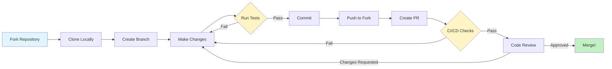
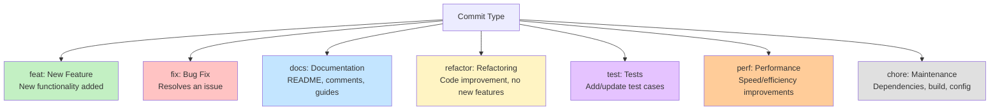

# Contributing to Cidadão.AI Backend

**Author**: Anderson Henrique da Silva
**Location**: Minas Gerais, Brazil
**Created**: 2025-08-13
**Last Updated**: 2025-11-18

---

Thank you for your interest in contributing to Cidadão.AI! This document provides guidelines and instructions for contributing to this project.

---

## Table of Contents

- [Code of Conduct](#code-of-conduct)
- [Getting Started](#getting-started)
- [Development Workflow](#development-workflow)
- [Code Standards](#code-standards)
- [Testing Requirements](#testing-requirements)
- [Commit Guidelines](#commit-guidelines)
- [Pull Request Process](#pull-request-process)
- [Agent Development](#agent-development)
- [Documentation](#documentation)
- [Community](#community)

---

## Code of Conduct

This project follows the **Contributor Covenant** code of conduct. We expect all contributors to:

- Be respectful and inclusive
- Welcome newcomers and help them get started
- Focus on constructive feedback
- Assume good intentions
- Prioritize the community's well-being

---

## 🗺️ Contribution Flow Diagram



---

## Getting Started

### Prerequisites

- **Python 3.11+** ([Download](https://www.python.org/downloads/))
- **Git** ([Download](https://git-scm.com/downloads))
- **Make** (usually pre-installed on Linux/macOS)

### Initial Setup

1. **Fork the repository** on GitHub

2. **Clone your fork**:
   ```bash
   git clone https://github.com/YOUR-USERNAME/cidadao.ai-backend.git
   cd cidadao.ai-backend
   ```

3. **Add upstream remote**:
   ```bash
   git remote add upstream https://github.com/anderson-ufrj/cidadao.ai-backend.git
   ```

4. **Create virtual environment**:
   ```bash
   python3 -m venv venv
   source venv/bin/activate  # On Windows: venv\Scripts\activate
   ```

5. **Install dependencies**:
   ```bash
   make install-dev
   ```

6. **Configure environment**:
   ```bash
   cp .env.example .env
   # Edit .env and add your API keys
   ```

7. **Verify installation**:
   ```bash
   JWT_SECRET_KEY=test SECRET_KEY=test make test
   ```

---

## Development Workflow

### 1. Create a Feature Branch

```bash
# Update your main branch
git checkout main
git pull upstream main

# Create feature branch
git checkout -b feat/your-feature-name
```

### 2. Make Your Changes

Follow our [Code Standards](#code-standards) and ensure:
- Code is well-documented
- Tests are included
- All checks pass locally

### 3. Run Quality Checks

**Before committing**, always run:

```bash
# Format code
make format

# Run all checks (lint + type-check + test)
make check
```

### 4. Commit Your Changes

Follow our [Commit Guidelines](#commit-guidelines):

```bash
git add .
git commit -m "feat(agents): add fraud detection to Oxossi agent"
```

### 5. Push and Create PR

```bash
git push origin feat/your-feature-name
# Then create PR on GitHub
```

---

## Code Standards

### Python Style Guide

We follow **PEP 8** with these tools:

- **Black**: Code formatter (88 character line length)
- **Ruff**: Fast Python linter
- **MyPy**: Static type checker
- **isort**: Import statement organizer

### Key Conventions

#### 1. Type Hints (Required)

```python
# Good
async def process_data(data: dict[str, Any], limit: int = 100) -> list[str]:
    results: list[str] = []
    return results

# Bad
async def process_data(data, limit=100):
    results = []
    return results
```

#### 2. Async/Await Pattern

```python
# Good
async def fetch_contracts() -> list[Contract]:
    async with httpx.AsyncClient() as client:
        response = await client.get(url)
        return response.json()

# Bad
def fetch_contracts():
    response = requests.get(url)  # Blocking I/O
    return response.json()
```

#### 3. Docstrings (Required for Public APIs)

```python
async def detect_anomalies(
    contracts: list[Contract],
    threshold: float = 2.5
) -> list[Anomaly]:
    """
    Detect anomalies in government contracts using statistical analysis.

    Args:
        contracts: List of contracts to analyze
        threshold: Standard deviation threshold for anomaly detection

    Returns:
        List of detected anomalies with confidence scores

    Raises:
        ValueError: If contracts list is empty
    """
```

#### 4. Error Handling

```python
# Good
try:
    result = await risky_operation()
except SpecificError as e:
    logger.error(f"Operation failed: {e}")
    raise HTTPException(status_code=500, detail=str(e)) from e

# Bad
try:
    result = await risky_operation()
except:  # Too broad, no logging
    pass
```

### Running Code Quality Tools

```bash
# Format code automatically
make format

# Run linter
make lint

# Run type checker
make type-check

# Run all checks
make check
```

---

## Testing Requirements

### Coverage Standards

- **New code**: Minimum **80% coverage** required
- **Critical paths**: Aim for **90%+ coverage**
- **Agent code**: **100% coverage** for core methods

### Test Categories

```bash
# Run all tests
JWT_SECRET_KEY=test SECRET_KEY=test make test

# Unit tests (fast, isolated)
make test-unit

# Integration tests (external dependencies)
make test-integration

# Agent-specific tests
JWT_SECRET_KEY=test SECRET_KEY=test pytest tests/unit/agents/test_zumbi.py -v
```

### Writing Tests

#### Example: Agent Test

```python
import pytest
from src.agents.zumbi import ZumbiAgent
from src.agents.deodoro import AgentMessage, AgentContext

@pytest.mark.asyncio
async def test_anomaly_detection():
    """Test Zumbi agent detects price anomalies."""
    agent = ZumbiAgent()

    # Arrange
    contracts = [
        {"valor": 100.0},
        {"valor": 105.0},
        {"valor": 500.0},  # Anomaly
    ]
    message = AgentMessage(
        message_id="test-001",
        content={"contracts": contracts}
    )

    # Act
    response = await agent.process(message, AgentContext())

    # Assert
    assert response.status == "success"
    assert len(response.content["anomalies"]) == 1
    assert response.content["anomalies"][0]["valor"] == 500.0
```

#### Example: API Test

```python
from fastapi.testclient import TestClient
from src.api.app import app

client = TestClient(app)

def test_health_endpoint():
    """Test health endpoint returns 200."""
    response = client.get("/health/")
    assert response.status_code == 200
    assert response.json()["status"] == "healthy"
```

### Test Fixtures

Use fixtures for common test data:

```python
@pytest.fixture
def sample_contracts():
    """Provide sample contracts for testing."""
    return [
        {"id": "001", "valor": 100.0, "fornecedor": "Company A"},
        {"id": "002", "valor": 200.0, "fornecedor": "Company B"},
    ]

@pytest.mark.asyncio
async def test_with_fixture(sample_contracts):
    result = await analyze(sample_contracts)
    assert len(result) == 2
```

---

## Commit Guidelines

We follow **Conventional Commits** specification.

### Commit Message Format

```
<type>(<scope>): <subject>

<body>

<footer>
```

### Types



**Type Reference:**
- `feat`: New feature
- `fix`: Bug fix
- `docs`: Documentation changes
- `refactor`: Code refactoring (no functionality change)
- `test`: Adding or updating tests
- `perf`: Performance improvement
- `chore`: Maintenance tasks (dependencies, build, etc.)

### Examples

```bash
# Good commits
git commit -m "feat(agents): add Benford's Law to Obaluaiê agent"
git commit -m "fix(api): resolve SSE streaming timeout in chat endpoint"
git commit -m "docs(agents): update Zumbi agent capabilities in README"
git commit -m "test(orchestration): add integration tests for entity graph"
git commit -m "refactor(services): consolidate cache implementations"
git commit -m "perf(agents): optimize FFT algorithm in anomaly detection"

# Bad commits
git commit -m "updates"
git commit -m "fixed stuff"
git commit -m "WIP"
```

### Multi-line Commits

For complex changes:

```bash
git commit -m "feat(agents): implement fraud detection in Oxossi

- Add bid rigging pattern detection
- Add phantom vendor analysis
- Add price fixing detection
- Include 85% confidence threshold

Closes #123"
```

---

## Pull Request Process

### Before Creating a PR

1. **Update from upstream**:
   ```bash
   git checkout main
   git pull upstream main
   git checkout your-feature-branch
   git rebase main
   ```

2. **Run full CI locally**:
   ```bash
   make ci
   ```

3. **Verify all tests pass**:
   ```bash
   JWT_SECRET_KEY=test SECRET_KEY=test make test
   ```

### PR Title Format

Follow same format as commits:

```
feat(agents): add fraud detection to Oxossi agent
```

### PR Description Template

```markdown
## Description
Brief description of changes.

## Type of Change
- [ ] Bug fix (non-breaking change fixing an issue)
- [ ] New feature (non-breaking change adding functionality)
- [ ] Breaking change (fix or feature causing existing functionality to change)
- [ ] Documentation update

## Changes Made
- Change 1
- Change 2
- Change 3

## Testing
- [ ] All tests pass locally
- [ ] Added tests for new functionality
- [ ] Coverage remains above 80%

## Checklist
- [ ] Code follows project style guidelines
- [ ] Self-review completed
- [ ] Documentation updated
- [ ] No breaking changes (or documented if unavoidable)
```

### Review Process

1. **Automated checks** must pass (CI/CD pipeline)
2. **At least 1 maintainer approval** required
3. **Address review feedback** promptly
4. **Squash commits** if requested (keep history clean)

### After Merge

1. **Delete your branch**:
   ```bash
   git branch -d feat/your-feature-name
   git push origin --delete feat/your-feature-name
   ```

2. **Update your fork**:
   ```bash
   git checkout main
   git pull upstream main
   git push origin main
   ```

---

## Agent Development

### Creating a New Agent

Follow this pattern for all agents:

```python
from src.agents.deodoro import ReflectiveAgent, AgentMessage, AgentResponse, AgentContext

class YourAgent(ReflectiveAgent):
    """
    Brief description of agent purpose.

    Historical Figure: [Name and significance]
    Specialization: [Core capability]
    """

    def __init__(self):
        super().__init__(
            agent_id="your_agent_id",
            name="Full Agent Name",
            description="Detailed capabilities and purpose",
            capabilities=[
                "capability_1",
                "capability_2",
                "capability_3"
            ]
        )
        self.quality_threshold = 0.8
        self.max_iterations = 3

    async def process(
        self,
        message: AgentMessage,
        context: AgentContext
    ) -> AgentResponse:
        """
        Main processing logic.

        Args:
            message: Input message with user query
            context: Execution context (user_id, session_id, etc.)

        Returns:
            AgentResponse with results and metadata
        """
        try:
            # 1. Extract and validate input
            data = message.content

            # 2. Perform core analysis
            results = await self._analyze(data)

            # 3. Apply reflection for quality control
            if results.get("confidence", 0) < self.quality_threshold:
                return await self.reflect_and_retry(message, results)

            # 4. Return response
            return AgentResponse(
                agent_id=self.agent_id,
                message_id=message.message_id,
                content=results,
                metadata={
                    "confidence": results.get("confidence"),
                    "method": "your_method_name"
                }
            )
        except Exception as e:
            self.logger.error(f"Processing error: {e}")
            raise

    async def _analyze(self, data: dict) -> dict:
        """Core analysis logic (implement your algorithm here)."""
        # Your implementation
        pass
```

### Agent Checklist

Before submitting an agent PR:

- [ ] Inherits from `ReflectiveAgent`
- [ ] Implements `process()` method
- [ ] Uses reflection pattern for quality control
- [ ] Has comprehensive docstrings
- [ ] Includes type hints
- [ ] Has 80%+ test coverage
- [ ] Documented in `docs/agents/<agent_name>.md`
- [ ] Registered in `src/agents/__init__.py`

---

## Documentation

### Required Documentation

When adding features, update:

1. **Code docstrings** (all public APIs)
2. **Agent documentation** (`docs/agents/<agent>.md`)
3. **Architecture docs** (`docs/architecture/`)
4. **CHANGELOG.md** (for notable changes)
5. **README.md** (if adding major features)

### Documentation Style

- Use **Markdown** for all documentation
- Include **code examples** where relevant
- Keep **examples realistic** (use real-world scenarios)
- Add **diagrams** for complex flows (Mermaid preferred)

### Example: Agent Documentation

Create `docs/agents/your_agent.md`:

```markdown
# Your Agent Name

**Historical Figure**: [Name] ([Years])
**Role**: [Historical significance]
**Specialization**: [Core capability]

## Overview

Brief description of what this agent does and why it exists.

## Capabilities

- Capability 1: Description
- Capability 2: Description
- Capability 3: Description

## Implementation Details

### Algorithm

Describe the core algorithm or methodology.

### Quality Threshold

- **Minimum Confidence**: 0.8 (80%)
- **Max Iterations**: 3 reflections

## Usage

\`\`\`python
from src.agents.your_agent import YourAgent

agent = YourAgent()
result = await agent.process(message, context)
\`\`\`

## Example Output

\`\`\`json
{
  "status": "success",
  "results": [...],
  "confidence": 0.92
}
\`\`\`

## Testing

See `tests/unit/agents/test_your_agent.py` for test examples.
```

---

## Community

### Getting Help

- **GitHub Issues**: Bug reports and feature requests
- **GitHub Discussions**: Questions and general discussion
- **Documentation**: Check `docs/` folder first

### Reporting Bugs

Use the bug report template and include:

1. **Environment** (OS, Python version, etc.)
2. **Steps to reproduce**
3. **Expected behavior**
4. **Actual behavior**
5. **Error messages** (full traceback)

### Suggesting Features

Use the feature request template and include:

1. **Problem statement** (what pain point does this solve?)
2. **Proposed solution**
3. **Alternatives considered**
4. **Implementation notes** (if you have ideas)

### Code Review Guidelines

When reviewing PRs:

- **Be constructive** and respectful
- **Explain reasoning** behind suggestions
- **Focus on code quality**, not personal preferences
- **Test the changes** if possible
- **Approve quickly** if everything looks good

---

## Quick Reference

### Common Commands

```bash
# Development
make run-dev              # Start dev server with hot reload
make format               # Format code (Black + isort)
make lint                 # Run linter (Ruff)
make type-check           # Type checking (MyPy)
make check                # Lint + Type-check + Test

# Testing
make test                 # Run all tests
make test-unit            # Unit tests only
make test-integration     # Integration tests only
make test-coverage        # Generate coverage report

# Database
make migrate              # Create new migration
make db-upgrade           # Apply migrations

# CI/CD
make ci                   # Run full CI pipeline locally
```

### File Structure

```
cidadao.ai-backend/
├── src/
│   ├── agents/           # AI agents (add your agent here)
│   ├── api/              # FastAPI routes
│   ├── services/         # Business logic
│   └── models/           # SQLAlchemy models
├── tests/
│   ├── unit/             # Unit tests (add your tests here)
│   └── integration/      # Integration tests
├── docs/
│   ├── agents/           # Agent documentation (add your agent docs)
│   └── architecture/     # Architecture docs
└── scripts/              # Automation scripts
```

---

## Thank You!

Your contributions make Cidadão.AI better for everyone working to increase government transparency in Brazil. Thank you for taking the time to contribute!

**Happy coding!** 🚀🇧🇷
