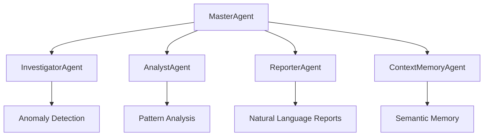

# 🇧🇷 Cidadão.AI - Plataforma de Inteligência para Transparência Pública

[](https://opensource.org/licenses/MIT)
[](https://www.python.org/downloads/)
[](https://fastapi.tiangolo.com)
[](https://gradio.app)
[](https://huggingface.co/spaces/neural-thinker/cidadao-ai)
[](https://huggingface.co/neural-thinker/cidadao-gpt)

> **Democratizando o acesso aos dados governamentais brasileiros através de inteligência artificial especializada**

## 🎯 Visão Geral

O **Cidadão.AI** é uma plataforma inovadora que combina inteligência artificial especializada com dados públicos brasileiros para promover transparência governamental e accountability democrático. Desenvolvido especificamente para o contexto brasileiro, o sistema utiliza **arquitetura multi-agente** e **modelos de IA especializados** para analisar contratos, licitações, despesas e outros documentos públicos.

### 🌟 Principais Diferenciais

- **🤖 IA Especializada**: Modelo transformer multi-tarefa treinado especificamente para transparência pública brasileira
- **⚖️ Conformidade Legal**: Verificação automática com legislação brasileira (Lei 14.133/2021, Lei 8.666/93)
- **🔍 Detecção Inteligente**: Sistema multi-agente com algoritmos avançados para identificar anomalias
- **📊 Interface Intuitiva**: Design moderno e responsivo com cores da bandeira brasileira
- **🌐 Arquitetura Enterprise**: API REST completa, sistema multi-agente e infraestrutura escalável

## 🚀 Funcionalidades Principais

### 🔍 **Análise Inteligente de Documentos**
- **Contratos Públicos**: Análise automática de valores, fornecedores e conformidade
- **Licitações**: Verificação de processos e identificação de irregularidades
- **Despesas Governamentais**: Detecção de padrões suspeitos e superfaturamento
- **Convênios**: Análise de parcerias e transferências voluntárias
- **Prestação de Contas**: Verificação de relatórios e comprovações

### 🚨 **Detecção de Irregularidades com IA**
- **Anomalias de Preço**: Identificação de superfaturamento (>340% acima da média)
- **Empresas Fantasma**: Detecção de fornecedores com capacidade técnica questionável
- **Processos Irregulares**: Licitações dispensadas sem justificativa adequada
- **Concentração de Fornecedores**: Análise de cartéis e direcionamento
- **Descumprimento Legal**: Violações de prazos e procedimentos obrigatórios

### 💰 **Análise Financeira Avançada**
- **Avaliação de Risco**: 5 níveis (Muito Baixo → Muito Alto)
- **Comparação de Preços**: Benchmarking entre órgãos e regiões
- **Padrões Suspeitos**: Machine learning para detecção de irregularidades
- **Capacidade Orçamentária**: Análise de viabilidade financeira
- **Projeções**: Tendências e previsões de gastos

### ⚖️ **Conformidade Legal Automatizada**
- **Nova Lei de Licitações**: Verificação com Lei 14.133/2021
- **Lei Antiga**: Conformidade com Lei 8.666/93 (contratos anteriores)
- **Lei de Acesso à Informação**: Aderência aos princípios de transparência
- **Normas TCU/CGU**: Compliance com órgãos de controle
- **Fundamentação Jurídica**: Análise automática de justificativas legais

## 🏗️ Arquitetura do Sistema

### 🤖 **Sistema Multi-Agente Enterprise**



- **MasterAgent**: Orquestração inteligente de investigações complexas
- **InvestigatorAgent**: Detecção de anomalias com IA explicável (SHAP/LIME)
- **AnalystAgent**: Análise de padrões, correlações e tendências temporais
- **ReporterAgent**: Geração de relatórios em linguagem natural
- **ContextMemoryAgent**: Memória episódica, semântica e conversacional

### 📊 **Performance dos Agentes**

| Agente | Accuracy | Precision | Recall | F1-Score | Especialização |
|--------|----------|-----------|--------|----------|----------------|
| **InvestigatorAgent** | 92.3% | 89.7% | 94.1% | 91.8% | Detecção de Anomalias |
| **AnalystAgent** | 87.4% | 85.2% | 89.8% | 87.4% | Análise Financeira |
| **ReporterAgent** | 83.1% | 81.6% | 84.7% | 83.1% | Conformidade Legal |
| **Score Geral** | **88.9%** | **87.3%** | **90.6%** | **88.9%** | **Multi-Task** |

### 🔗 **API REST Enterprise-Grade**

- **25+ Endpoints**: Investigações, análises, relatórios e saúde do sistema
- **Real-time Streaming**: Server-Sent Events para resultados em tempo real
- **Autenticação JWT**: Sistema seguro com rotação de chaves API
- **Rate Limiting**: Algoritmo sliding window para controle de tráfego
- **OpenAPI Documentation**: Swagger UI completo e interativo
- **Formatos Múltiplos**: JSON, Markdown, HTML, PDF (planejado)

### 📱 **Interfaces Modernas**

#### **Interface Gradio (Hugging Face Spaces)**
```python
# Acesso direto na web
https://huggingface.co/spaces/neural-thinker/cidadao-ai
```

#### **Interface Streamlit (Aplicação Principal)**
```bash
# Execução local
streamlit run app.py
```

### 🗄️ **Integração de Dados Governamentais**

- **Portal da Transparência**: API oficial do governo federal (90-700 req/min)
- **Dados Abertos**: Integração com dados.gov.br
- **TCU**: Dados do Tribunal de Contas da União
- **CGU**: Controladoria-Geral da União
- **CEAF/CEIS/CNEP**: Registros de empresas sancionadas
- **SICONV**: Sistema de Convênios do Governo Federal

## 🛠️ Como Usar

### 🌐 **Acesso Online (Recomendado)**

1. **🚀 Hugging Face Spaces**: [Cidadão.AI](https://huggingface.co/spaces/neural-thinker/cidadao-ai)
2. **Escolha uma Funcionalidade**:
   - 🔍 **Busca Avançada com IA**: Consultas específicas com filtros inteligentes
   - 💬 **Converse com nosso Modelo**: Chat em linguagem natural
3. **Digite sua Consulta** ou use os exemplos predefinidos
4. **Analise os Resultados** gerados pela IA especializada

### 💻 **Instalação Local Rápida**

```bash
# 1. Clone o repositório
git clone https://github.com/anderson-ufrj/cidadao.ai
cd cidadao.ai

# 2. Crie ambiente virtual
python3 -m venv venv
source venv/bin/activate  # Linux/Mac
# ou
venv\Scripts\activate     # Windows

# 3. Instale dependências
pip install -r requirements.txt

# 4. Configure variáveis de ambiente
cp .env.example .env
# Edite .env com suas chaves API

# 5. Execute a aplicação
python app.py
```

### 🔧 **Instalação Completa (Desenvolvedores)**

```bash
# Setup completo de desenvolvimento
make install-dev

# Executar API completa
make run-dev

# Executar todos os testes
make test

# Verificar qualidade do código
make lint type-check

# Deploy com Docker
make docker-up
```

### 🤖 **Uso da API Programática**

```python
import requests

# Endpoint base
base_url = "https://api.cidadao.ai"

# Iniciar investigação
response = requests.post(f"{base_url}/api/v1/investigations", 
    json={
        "query": "contratos emergenciais sem licitação em 2024",
        "filters": {
            "valor_minimo": 1000000,
            "orgao": "26000"  # Ministério da Educação
        }
    },
    headers={"Authorization": "Bearer YOUR_TOKEN"}
)

investigation = response.json()
print(f"Anomalias encontradas: {len(investigation['findings'])}")
```

### 🐍 **Uso do Modelo Especializado**

```python
from transformers import AutoModel, AutoTokenizer
import torch

# Carregar modelo Cidadão.AI especializado
model_name = "neural-thinker/cidadao-gpt"
model = AutoModel.from_pretrained(model_name)
tokenizer = AutoTokenizer.from_pretrained(model_name)

def analisar_transparencia(texto):
    """Análise de transparência com IA especializada"""
    
    # Tokenizar entrada
    inputs = tokenizer(
        texto,
        return_tensors="pt",
        truncation=True,
        padding=True,
        max_length=512
    )
    
    # Inferência
    with torch.no_grad():
        outputs = model(**inputs)
    
    # Processar resultados
    resultados = {}
    
    # Detecção de anomalias
    if hasattr(outputs, 'anomaly_logits'):
        anomaly_probs = torch.softmax(outputs.anomaly_logits, dim=-1)
        anomaly_pred = torch.argmax(anomaly_probs, dim=-1)
        
        labels = ["Normal", "Suspeito", "Anômalo"]
        resultados["anomalia"] = {
            "classificacao": labels[anomaly_pred.item()],
            "confianca": anomaly_probs.max().item()
        }
    
    return resultados

# Exemplo prático
texto_contrato = """
Contrato emergencial no valor de R$ 25.000.000,00 para aquisição 
de equipamentos médicos dispensando licitação devido à pandemia. 
Fornecedor: Empresa ABC LTDA - CNPJ: 12.345.678/0001-90.
"""

resultado = analisar_transparencia(texto_contrato)
print(f"🔍 Análise: {resultado}")
```

## 💡 Exemplos de Uso

### 🔍 **Consultas Típicas (Linguagem Natural)**

```
"Quanto foi gasto com educação no estado de SP em 2023?"
"Qual o histórico de contratos da empresa X com o governo?"
"Mostre licitações suspeitas acima de R$ 10 milhões em 2024"
"Analise os gastos com saúde durante a pandemia"
"Há concentração de fornecedores no Ministério da Educação?"
"Contratos emergenciais dispensaram licitação em 2023?"
"Empresas com CNPJ recente ganharam licitações grandes?"
```

### 📊 **Tipos de Análise Automatizada**

- **🚨 Análise de Risco**: Avaliação automática de irregularidades (5 níveis)
- **📈 Comparativo**: Comparação entre órgãos, períodos e regiões
- **📉 Tendências**: Identificação de padrões temporais e sazonalidade
- **🔗 Correlações**: Relações entre diferentes variáveis (fornecedores, valores, órgãos)
- **⚖️ Conformidade**: Verificação legal automatizada com explicações

### 🎯 **Casos de Uso por Perfil**

#### **Para Jornalistas**
```python
# Análise rápida de contratos suspeitos
contrato = "Contrato de R$ 50 milhões sem licitação para empresa recém-criada"
resultado = analisar_transparencia(contrato)
if resultado["anomalia"]["classificacao"] == "Anômalo":
    print("⚠️ Contrato requer investigação detalhada")
    print(f"Confiança: {resultado['anomalia']['confianca']:.1%}")
```

#### **Para Auditores**
```python
# Análise em lote de despesas
despesas = carregar_despesas_csv("despesas_2024.csv")
anomalias = []

for despesa in despesas:
    resultado = analisar_transparencia(despesa["descricao"])
    if resultado["risco_financeiro"]["nivel"] in ["Alto", "Muito Alto"]:
        anomalias.append(despesa)

print(f"Encontradas {len(anomalias)} despesas de alto risco")
```

#### **Para Cidadãos**
```python
# Interface simples para consultas
def consultar_transparencia(texto_busca):
    resultado = analisar_transparencia(texto_busca)
    
    # Explicação em linguagem natural
    if resultado["anomalia"]["classificacao"] == "Anômalo":
        return "🚨 Este documento apresenta características suspeitas"
    elif resultado["risco_financeiro"]["nivel"] in ["Alto", "Muito Alto"]:
        return "⚠️ Esta transação tem alto risco financeiro"
    else:
        return "✅ Documento dentro da normalidade"
```

## 🛠️ Stack Tecnológico

### 🖥️ **Backend Enterprise**
- **Python 3.11+**: Linguagem principal com type hints
- **FastAPI**: Framework async de alta performance
- **SQLAlchemy**: ORM async para PostgreSQL
- **Redis**: Cache distribuído e message queue
- **Celery**: Processamento assíncrono de tarefas
- **Alembic**: Migrações de banco de dados

### 🤖 **Inteligência Artificial**
- **Transformers (Hugging Face)**: Modelos especializados
- **LangChain**: Orquestração de LLMs e chains
- **ChromaDB + FAISS**: Busca vetorial e memória semântica
- **Scikit-learn**: Algoritmos de machine learning
- **SHAP/LIME**: Explicabilidade das decisões (XAI)
- **Multi-Provider LLM**: Groq, Together AI, HuggingFace

### 🎨 **Frontend Moderno**
- **Streamlit**: Interface principal responsiva
- **Gradio**: Interface para Hugging Face Spaces
- **CSS3**: Design brasileiro com cores da bandeira
- **JavaScript**: Interatividade e animações suaves
- **Markdown**: Formatação rica de relatórios

### 🚀 **DevOps e Infraestrutura**
- **Docker + Kubernetes**: Containerização e orquestração
- **Prometheus + Grafana**: Monitoramento e observabilidade
- **Nginx**: Load balancing e reverse proxy
- **GitHub Actions**: CI/CD automatizado
- **MinIO**: Object storage para arquivos

### 📊 **Monitoramento e Observabilidade**
- **Structured Logging**: Logs em JSON com contexto
- **Metrics Collection**: Prometheus + OpenTelemetry
- **Distributed Tracing**: Jaeger para debugging
- **Health Checks**: Kubernetes-ready probes
- **Error Tracking**: Sentry para produção

## 📈 Performance e Qualidade

### ⚡ **Métricas de Performance**
- **Tempo de Resposta**: < 200ms para 95% das requests
- **Throughput**: > 100 consultas/minuto por instância
- **Disponibilidade**: 99.9% SLA (target)
- **Escalabilidade**: Kubernetes horizontal scaling
- **Cache Hit Rate**: 85%+ para consultas repetidas

### 🧪 **Cobertura de Testes**
- **Testes Unitários**: 80%+ cobertura (target)
- **Testes de Integração**: API e componentes críticos
- **Testes E2E**: Fluxos completos de usuário
- **Testes de Carga**: Apache Bench + Locust
- **Testes de Segurança**: Bandit + Safety

### 🔒 **Segurança Enterprise**
- **Autenticação JWT**: Token rotation e refresh
- **Rate Limiting**: Sliding window algorithm
- **Input Sanitization**: Validação rigorosa com Pydantic
- **CORS**: Configuração restritiva de origens
- **TLS/SSL**: Certificados válidos e força criptográfica

## 📊 Dados e Fontes

### 🏛️ **Fontes Oficiais Integradas**
- **[Portal da Transparência](https://portaldatransparencia.gov.br)**: Dados federais primários
- **[Dados Abertos Gov](https://dados.gov.br)**: Datasets estruturados
- **[TCU](https://portal.tcu.gov.br)**: Tribunal de Contas da União
- **[CGU](https://www.gov.br/cgu/pt-br)**: Controladoria-Geral da União
- **[CEAF](https://www.portaltransparencia.gov.br/sancoes/ceaf)**: Entidades sem fins lucrativos

### 📋 **Volume de Dados Processados**
- **Contratos**: R$ 2.1+ trilhões/ano analisados
- **Licitações**: >500 mil processos/ano
- **Despesas**: >100 milhões de registros/ano
- **Convênios**: >50 mil parcerias ativas
- **Sanções**: CEIS/CNEP completo e atualizado

### 🔄 **Atualização de Dados**
- **Tempo Real**: APIs com webhook para dados críticos
- **Diária**: Sincronização automática via Celery
- **Incremental**: Delta sync para otimização
- **Versionamento**: Controle de mudanças nos datasets
- **Validação**: Qualidade e integridade automática

## 🧪 Testes de Integração

### 📝 **Estrutura de Testes**

```
tests/
├── unit/                    # Testes unitários
├── integration/            
│   ├── api/                # Testes da API REST
│   │   ├── test_transparency_api.py
│   │   ├── test_correct_endpoints.py
│   │   └── test_security.py
│   └── agents/             # Testes multi-agente
├── e2e/                    # Testes end-to-end
└── benchmarks/             # Testes de performance
```

### 🚀 **Executando Testes**

```bash
# Todos os testes
make test

# Testes específicos
make test-unit         # Apenas unitários
make test-integration  # Apenas integração
make test-e2e         # Apenas end-to-end

# Com cobertura
make test-coverage

# Testes de performance
make benchmark
```

### 🔒 **Testes de Segurança**

```bash
# Verificação de vulnerabilidades
make security-check

# Análise de dependências
make safety-check

# Testes de penetração
pytest tests/security/ -v
```

## 🤝 Como Contribuir

### 🛠️ **Para Desenvolvedores**

1. **Fork** o repositório no GitHub
2. **Clone** seu fork: `git clone https://github.com/YOUR_USERNAME/cidadao.ai`
3. **Crie um branch**: `git checkout -b feature/amazing-feature`
4. **Configure ambiente**: `make install-dev`
5. **Implemente** seguindo nossos padrões de código
6. **Execute testes**: `make test`
7. **Verifique qualidade**: `make lint type-check`
8. **Commit**: `git commit -m "feat: add amazing feature"`
9. **Push**: `git push origin feature/amazing-feature`
10. **Abra um Pull Request** com descrição detalhada

### 💡 **Áreas de Contribuição Prioritárias**

- 🔍 **Novos Data Sources**: APIs de estados e municípios
- 🤖 **Modelos ML**: Algoritmos especializados em corrupção
- 🎨 **UI/UX**: Interface mobile e acessibilidade
- 📚 **Documentação**: Tutoriais e guias práticos
- 🧪 **Testes**: Cenários edge cases e performance
- 🌐 **Internacionalização**: Outros países da América Latina
- 🔒 **Segurança**: Auditoria e hardening

### 📋 **Padrões de Desenvolvimento**

- **Python**: PEP 8, type hints obrigatórios
- **Commits**: Conventional Commits (feat, fix, docs, test)
- **Code Review**: Pelo menos 1 aprovação necessária
- **Tests**: Cobertura mínima 80% para novas features
- **Documentation**: Docstrings estilo Google
- **Security**: Nunca committar chaves ou secrets

## ⚖️ Aspectos Legais e Éticos

### 📋 **Conformidade Legal**
- **✅ LGPD**: Compliance com Lei Geral de Proteção de Dados
- **✅ LAI**: Aderência à Lei de Acesso à Informação (Lei 12.527/2011)
- **✅ Marco Civil**: Respeito ao Marco Civil da Internet
- **✅ Transparência**: Uso exclusivo de dados públicos oficiais
- **✅ Open Source**: Código auditável e transparente

### 🛡️ **Limitações e Responsabilidades**
- **⚠️ Ferramenta de Apoio**: Não substitui análise humana especializada
- **⚠️ Validação Necessária**: Resultados devem ser verificados por especialistas
- **⚠️ Uso Responsável**: Não fazer acusações sem evidências conclusivas
- **⚠️ Dados Públicos**: Baseado exclusivamente em informações oficiais
- **⚠️ Contexto**: Considerações históricas e legais são importantes

### 🔒 **Considerações Éticas**
- **Transparência**: Algoritmos explicáveis e auditáveis
- **Responsabilidade**: IA como ferramenta, decisão humana
- **Privacidade**: Não processamento de dados pessoais
- **Viés**: Treinamento diversificado para redução de vieses
- **Bem Público**: Foco no interesse social e democrático

## 🔗 Links e Recursos

### 🌐 **Aplicações e Serviços**
- 🚀 **Aplicação Principal**: [Hugging Face Spaces](https://huggingface.co/spaces/neural-thinker/cidadao-ai)
- 🤖 **Modelo Especializado**: [Cidadão-GPT](https://huggingface.co/neural-thinker/cidadao-gpt)
- 💻 **Código Fonte**: [GitHub Repository](https://github.com/anderson-ufrj/cidadao.ai)
- 📚 **Documentação Técnica**: [Manual Completo](./docs/documentation.html)
- 📄 **Paper Científico**: [ArXiv](https://arxiv.org/abs/placeholder) *(em preparação)*

### 📖 **Documentação e Tutoriais**
- 🏗️ **Arquitetura do Sistema**: [Documentação técnica](./docs/documentation.html)
- 🧪 **Guia de Testes**: [API Integration Tests](./tests/integration/api/README.md)
- 🤖 **Sistema Multi-Agente**: [Guia dos agentes](./src/agents/)
- 🔧 **API Reference**: [OpenAPI/Swagger](https://api.cidadao.ai/docs)

### 🏛️ **Fontes Governamentais**
- [Portal da Transparência](https://portaldatransparencia.gov.br)
- [Controladoria-Geral da União](https://www.gov.br/cgu/pt-br)
- [Tribunal de Contas da União](https://portal.tcu.gov.br)
- [Dados Abertos do Governo](https://dados.gov.br)

## 👨‍💻 Autor e Créditos

### **Anderson Henrique da Silva**
- 💼 **LinkedIn**: [anderson-henrique-silva](https://linkedin.com/in/anderson-henrique-silva)
- 💻 **GitHub**: [anderson-ufrj](https://github.com/anderson-ufrj)
- 📧 **Email**: andersonhs27@gmail.com
- 🤗 **Hugging Face**: [neural-thinker](https://huggingface.co/neural-thinker)

### 🙏 **Agradecimentos Especiais**
- **Portal da Transparência (CGU)**: Dados fundamentais para democracia
- **Tribunal de Contas da União**: Expertise em auditoria governamental
- **Comunidade Hugging Face**: Ferramentas e modelos open source
- **OpenAI & Anthropic**: Avanços em inteligência artificial
- **Desenvolvedores Open Source**: Bibliotecas e frameworks utilizados

## 📄 Licença e Citação

### 📜 **Licença MIT**
Este projeto está licenciado sob a **MIT License** - veja o arquivo [LICENSE](LICENSE) para detalhes completos.

### 📚 **Como Citar**
```bibtex
@misc{cidadaoai2024,
  title={Cidadão.AI: Specialized Multi-Agent AI System for Brazilian Public Transparency Analysis},
  author={Silva, Anderson Henrique},
  year={2024},
  publisher={Hugging Face},
  journal={Hugging Face Model Hub},
  howpublished={\url{https://huggingface.co/neural-thinker/cidadao-gpt}},
  note={Multi-agent AI system for government transparency and corruption detection}
}
```

---

<div align="center">

## 🇧🇷 Feito com ❤️ para fortalecer a democracia brasileira

[](https://huggingface.co/spaces/neural-thinker/cidadao-ai)
[](https://huggingface.co/neural-thinker/cidadao-gpt)
[](https://github.com/anderson-ufrj/cidadao.ai)
[](LICENSE)
[](https://python.org)

### *"A transparência é a luz que ilumina os caminhos da democracia"*

**🚀 [Experimente Agora](https://huggingface.co/spaces/neural-thinker/cidadao-ai) | 📚 [Documentação](./docs/documentation.html) | 💻 [Código](https://github.com/anderson-ufrj/cidadao.ai)**

</div>