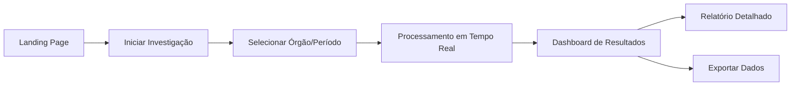

# 🎨 Plano de Integração Frontend-Backend

**Status**: Frontend estruturado, pronto para integração  
**Stack**: Next.js 15 + React 19 + TypeScript + Tailwind CSS  
**Backend**: FastAPI com 8 agentes funcionais

## 🎯 Objetivo

Criar uma interface visual atraente que permita aos cidadãos:
1. **Investigar** contratos e gastos públicos
2. **Visualizar** anomalias detectadas
3. **Entender** os resultados através de relatórios claros
4. **Acompanhar** investigações em tempo real

## 🔄 Fluxo Principal de UX



## 📋 Páginas Necessárias

### 1. **Landing Page** ✅ (Já existe, melhorar)
```typescript
// Adicionar:
- Hero section com estatísticas em tempo real
- CTA "Investigar Agora"
- Exemplos de investigações recentes
- Indicador [DEMO] quando sem API key
```

### 2. **Nova Investigação** 🆕
```typescript
// /app/investigations/new/page.tsx
interface InvestigationForm {
  orgao: string          // Select com órgãos principais
  periodo: DateRange     // Seletor de período
  tipoAnalise: string[]  // Checkboxes: preços, fornecedores, temporal
  profundidade: 'rapida' | 'completa' | 'profunda'
}

// Componentes:
- <OrgaoSelector /> com autocomplete
- <PeriodSelector /> com presets (último mês, trimestre, ano)
- <AnalysisTypeSelector /> com tooltips explicativos
- <InvestigationPreview /> mostra o que será analisado
```

### 3. **Dashboard de Investigação** 🆕
```typescript
// /app/investigations/[id]/page.tsx
// Tempo real via SSE (já preparado no cliente)

// Seções:
- <ProgressTracker /> - Qual agente está trabalhando
- <FindingsStream /> - Anomalias aparecem conforme detectadas
- <AgentActivity /> - Log visual dos agentes
- <RiskMeter /> - Indicador visual de risco geral
```

### 4. **Visualização de Resultados** 🆕
```typescript
// Componentes de visualização:
- <AnomalyChart /> - Gráfico de dispersão para outliers
- <VendorConcentration /> - Gráfico de pizza/treemap
- <TimelineAnalysis /> - Linha temporal de gastos
- <ContractTable /> - Tabela interativa com filtros
```

### 5. **Relatório Interativo** 🆕
```typescript
// /app/reports/[id]/page.tsx
- <ExecutiveSummary /> - Resumo para cidadão comum
- <DetailedFindings /> - Achados com evidências
- <Recommendations /> - Sugestões de ação
- <ShareButtons /> - Compartilhar resultados
```

## 🎨 Componentes Visuais Prioritários

### 1. **InvestigationCard**
```tsx
interface InvestigationCardProps {
  id: string
  orgao: string
  status: 'processing' | 'completed' | 'failed'
  anomaliesCount: number
  riskLevel: 'low' | 'medium' | 'high' | 'critical'
  progress: number
}

// Visual com:
- Gradiente baseado no riskLevel
- Progress bar animado
- Badge com contagem de anomalias
- Ícone do órgão
```

### 2. **AnomalyAlert**
```tsx
interface AnomalyAlertProps {
  type: 'price' | 'vendor' | 'temporal' | 'duplicate'
  severity: 'low' | 'medium' | 'high' | 'critical'
  title: string
  description: string
  evidence: Evidence[]
  affectedContracts: number
}

// Visual com:
- Ícone e cor baseados no tipo
- Expansível para ver detalhes
- Links para contratos afetados
- Botão "Entenda mais"
```

### 3. **AgentAvatar**
```tsx
interface AgentAvatarProps {
  agentId: string
  status: 'idle' | 'working' | 'completed'
  message?: string
}

// Mostra:
- Avatar do agente (Zumbi, Anita, etc)
- Indicador de status animado
- Balão de fala com atividade atual
```

### 4. **RiskDashboard**
```tsx
interface RiskDashboardProps {
  overall: number // 0-100
  categories: {
    pricing: number
    vendors: number
    temporal: number
    compliance: number
  }
}

// Visualização:
- Gauge principal colorido
- Mini-gauges por categoria
- Trend indicators
- Comparação com média
```

## 🔌 Integração com Backend

### 1. **Configuração API**
```typescript
// .env.local
NEXT_PUBLIC_API_BASE_URL=http://localhost:8000
NEXT_PUBLIC_DEMO_MODE=true  // Quando sem API key
```

### 2. **Hooks Customizados**
```typescript
// hooks/useInvestigation.ts
export function useInvestigation(id: string) {
  const { data, error, isLoading } = useSWR(
    `/api/v1/investigations/${id}`,
    investigationService.getStatus
  )
  
  // SSE para atualizações em tempo real
  useEffect(() => {
    const sse = investigationService.streamProgress(id, {
      onProgress: (update) => mutate()
    })
    return () => sse.close()
  }, [id])
  
  return { investigation: data, error, isLoading }
}
```

### 3. **Componentes Conectados**
```tsx
// components/investigations/NewInvestigationForm.tsx
export function NewInvestigationForm() {
  const { createInvestigation } = useInvestigationStore()
  const router = useRouter()
  
  const onSubmit = async (data: InvestigationRequest) => {
    const result = await createInvestigation(data)
    router.push(`/investigations/${result.id}`)
  }
  
  return (
    <Form onSubmit={onSubmit}>
      {/* Campos do formulário */}
    </Form>
  )
}
```

## 📊 Visualizações de Dados

### 1. **Bibliotecas Recomendadas**
```json
{
  "recharts": "^2.x",     // Gráficos React
  "react-table": "^8.x",   // Tabelas avançadas
  "framer-motion": "^11.x" // Animações fluidas
}
```

### 2. **Exemplos de Gráficos**
```tsx
// Anomalias de Preço (Scatter Plot)
<ScatterChart data={anomalies}>
  <XAxis dataKey="expectedPrice" />
  <YAxis dataKey="actualPrice" />
  <Scatter fill="#ef4444" />
  <ReferenceLine y={averagePrice} stroke="#10b981" />
</ScatterChart>

// Concentração de Fornecedores (Treemap)
<Treemap
  data={vendorConcentration}
  dataKey="totalValue"
  fill="#3b82f6"
  animationDuration={1000}
/>
```

## 🚀 Roadmap de Implementação

### Fase 1: MVP (1 semana)
1. ✅ Landing page melhorada
2. 🔄 Formulário de nova investigação
3. 🔄 Página de progresso em tempo real
4. 🔄 Dashboard básico de resultados

### Fase 2: Visualizações (1 semana)
1. 📊 Gráficos de anomalias
2. 📊 Tabelas interativas
3. 📊 Timeline de gastos
4. 📊 Métricas de risco

### Fase 3: Polish (1 semana)
1. 🎨 Animações e transições
2. 📱 Otimização mobile
3. 🌐 Internacionalização completa
4. ♿ Acessibilidade (WCAG 2.1)

### Fase 4: Features Avançadas
1. 📤 Export de dados (CSV, PDF)
2. 🔔 Notificações de progresso
3. 📊 Comparações históricas
4. 🤝 Compartilhamento social

## 🎯 Métricas de Sucesso

1. **Engajamento**: Tempo médio na página > 5min
2. **Clareza**: 90% entendem os resultados
3. **Performance**: LCP < 2.5s, FID < 100ms
4. **Acessibilidade**: Score > 95 no Lighthouse

## 🛠️ Desenvolvimento Local

```bash
# Frontend
cd cidadao.ai-frontend
npm install
npm run dev  # http://localhost:3000

# Backend (em outro terminal)
cd cidadao.ai-backend
python app.py  # http://localhost:7860
# ou
make run-dev   # http://localhost:8000
```

## 🔐 Segurança

1. **CORS** configurado no backend
2. **Rate limiting** no frontend
3. **Sanitização** de inputs
4. **CSP headers** apropriados

---

Este plano cria uma experiência visual rica e intuitiva que torna os dados de transparência acessíveis a todos os cidadãos! 🇧🇷