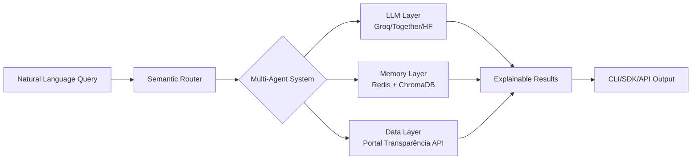

# 🔍 Cidadão.AI

> **"O que Brasília esconde, nossa IA revela."**

[](https://www.python.org/downloads/)
[](https://fastapi.tiangolo.com/)
[](LICENSE)
[](https://github.com/psf/black)
[](https://langchain.com/)
[](#-api-endpoints)
[](https://huggingface.co/spaces/neural-thinker/cidadao-ai)

**Sistema multi-agente de IA com API REST completa** que transforma dados brutos do Portal da Transparência em investigações inteligentes, democratizando o acesso à informação pública através de processamento de linguagem natural de última geração.

🔥 **NOVO**: API REST completa com endpoints para investigações, análises e relatórios em tempo real!

## 🎯 O Problema

Bilhões em recursos públicos. Milhões de registros. Zero transparência real.

Os dados existem, mas estão presos em APIs complexas, linguagem burocrática e formatos inacessíveis. **Cidadão.AI** quebra essas barreiras.

## 💡 A Solução

Uma IA que não apenas lê dados públicos — ela **investiga**, **questiona** e **explica** como um auditor veterano:

```bash
$ cidadao investigate "contratos emergenciais sem licitação em cidades pequenas"

🔍 Analisando 12,847 contratos...
⚠️  287 anomalias detectadas
📊 Padrão identificado: Valores 340% acima da média em municípios < 10k habitantes
💡 Explicação: Possível direcionamento - fornecedores registrados < 30 dias antes
```

## 🚀 Features que Impressionam

### 🧠 **Multi-Agent Intelligence** ✅ IMPLEMENTADO
- **Master Agent**: Orquestra investigações com capacidade de auto-reflexão
- **Investigator Agent**: Detecta anomalias com explicações em linguagem natural
- **Analyst Agent**: Correlaciona dados e identifica padrões ocultos
- **Reporter Agent**: Gera relatórios executivos automatizados
- **Context Memory Agent**: Gerencia memória episódica e semântica
- **Semantic Router**: Roteamento inteligente de consultas

### 💾 **Memória Contextual**
- **Episódica**: Lembra de investigações recentes
- **Semântica**: Conecta insights ao longo do tempo
- **Graph-based**: Mapeia relações entre entidades suspeitas

### 🔐 **Auditoria Blockchain-Style**
```python
# Cada investigação é imutável e rastreável
{
  "timestamp": "2024-01-15T14:32:17Z",
  "hash": "0x8a4b5c6d7e8f9a0b1c2d3e4f5a6b7c8d",
  "previous_hash": "0x7f3a9b2c4e5d6f8a9b0c1d2e3f4a5b6c",
  "investigation": {...},
  "signature": "RSA-4096-VALID"
}
```

### 🎯 **Explainable AI (XAI)**
Toda anomalia vem com explicação clara:
- Por que é suspeito
- Qual o desvio da normalidade
- Quais as evidências
- O que investigar next

### 🛠️ **Developer-First** ✅ API COMPLETA

**REST API poderosa:**
```bash
# Iniciar investigação
curl -X POST "http://localhost:8000/api/v1/investigations/start" \
  -H "Content-Type: application/json" \
  -d '{"query": "contratos emergenciais suspeitos", "data_source": "contracts"}'

# Stream de resultados em tempo real
curl "http://localhost:8000/api/v1/investigations/stream/{investigation_id}"

# Gerar relatório
curl -X POST "http://localhost:8000/api/v1/reports/generate" \
  -H "Content-Type: application/json" \
  -d '{"report_type": "executive_summary", "title": "Análise de Contratos 2024"}'
```

**CLI poderoso:**
```bash
cidadao watch --org "ministerio-saude" --alert-on anomaly
cidadao analyze --type predictive --metric "custo-per-capita"
cidadao export --format "tcu-report" --period "2024-Q1"
```

**SDK Python elegante:**
```python
from cidadao_ai import CidadaoClient

client = CidadaoClient()
anomalies = await client.detect_anomalies(
    organization="prefeitura-sp",
    explain=True,
    confidence_threshold=0.8
)
```

## 🏗️ Arquitetura



## 📊 Tecnologias Implementadas

- **AI/ML**: ✅ LangChain, Hugging Face, Groq, Together AI, SHAP/LIME
- **Backend**: ✅ FastAPI completo, PostgreSQL, Redis, autenticação JWT
- **API Features**: ✅ Streaming SSE, rate limiting, middleware de logging
- **Multi-Agent**: ✅ Sistema completo com 6 agentes especializados
- **Observability**: OpenTelemetry, Prometheus, Grafana (planejado)
- **Infrastructure**: Docker, GitHub Actions, S3 (planejado)

## 🚦 Quick Start

```bash
# Clone
git clone https://github.com/anderson-ufrj/cidadao.ai.git
cd cidadao-ai

# Setup
python -m venv venv
source venv/bin/activate
pip install -e ".[dev]"

# Configure
cp .env.example .env
# Add your API keys (Portal Transparência, Groq/Together)

# Run API Server
python -m src.api.app
# ou
uvicorn src.api.app:app --reload

# Acesse a documentação
open http://localhost:8000/docs

# Run CLI
cidadao investigate "sua primeira investigação"
```

## 📈 Status de Implementação

### ✅ Completo
- **API REST**: 15+ endpoints implementados
- **Multi-Agents**: 6 agentes especializados
- **LLM Integration**: 3 providers com fallback
- **Real-time**: Streaming de resultados
- **Auth**: JWT + API Key
- **Docs**: OpenAPI/Swagger automático

### 🔄 Em Desenvolvimento  
- **Interface Web**: Frontend interativo
- **Database**: Integração PostgreSQL/Redis
- **WebSocket**: Comunicação bidirecional

## 🌐 API Endpoints

### 🏥 Health Check
- `GET /health` - Status básico do sistema
- `GET /health/detailed` - Informações detalhadas
- `GET /health/live` - Kubernetes liveness probe
- `GET /health/ready` - Kubernetes readiness probe

### 🔍 Investigations
- `POST /api/v1/investigations/start` - Iniciar investigação
- `GET /api/v1/investigations/stream/{id}` - Stream em tempo real
- `GET /api/v1/investigations/{id}/status` - Status da investigação
- `GET /api/v1/investigations/{id}/results` - Resultados completos
- `GET /api/v1/investigations/` - Listar investigações
- `DELETE /api/v1/investigations/{id}` - Cancelar investigação

### 📊 Analysis
- `POST /api/v1/analysis/start` - Iniciar análise de padrões
- `GET /api/v1/analysis/trends` - Análise de tendências
- `GET /api/v1/analysis/correlations` - Análise de correlações
- `GET /api/v1/analysis/patterns` - Detecção de padrões
- `GET /api/v1/analysis/{id}/results` - Resultados completos

### 📄 Reports
- `POST /api/v1/reports/generate` - Gerar relatório
- `GET /api/v1/reports/templates` - Templates disponíveis
- `GET /api/v1/reports/{id}` - Obter relatório
- `GET /api/v1/reports/{id}/download` - Download (HTML/MD/JSON)
- `GET /api/v1/reports/` - Listar relatórios

## 🎯 Use Cases

1. **Jornalistas**: Investigações data-driven via API
2. **Desenvolvedores**: Integração com sistemas existentes
3. **ONGs**: Monitoramento automático de gastos
4. **Órgãos de Controle**: Detecção proativa de irregularidades
5. **Cidadãos**: Acesso democrático à informação complexa

## 🔒 Licença

Este projeto está licenciado sob a licença MIT - veja o arquivo [LICENSE](LICENSE) para detalhes.

Para parcerias e colaborações: andersonhs27@gmail.com

## 🤝 Sobre o Autor

**Anderson H. Silva**  
*Arquiteto de Inteligência Digital | Filosofia + ML + Ética*

- 🔗 [LinkedIn](https://www.linkedin.com/in/anderson-h-silva95/)
- 🐦 [X/Twitter](https://twitter.com/neural_thinker)
- 📧 andersonhs27@gmail.com

## 🚀 Deploy e Produção

```bash
# Docker
docker build -t cidadao-ai .
docker run -p 8000:8000 cidadao-ai

# Kubernetes (em breve)
kubectl apply -f k8s/

# Monitoramento
# OpenAPI docs: http://localhost:8000/docs
# Health check: http://localhost:8000/health
```

---

<p align="center">
  <i>"A máquina que não apenas entende o Estado — mas o interroga."</i>
</p>

<p align="center">
  <b>⭐ Star este projeto se você acredita em transparência real e no poder do cidadão informado</b>
</p>
