# 🤖 Agents Documentation Index

**Last Updated**: 2025-11-08
**Total Agents**: 16 operational + 1 base framework

---

## 📑 Quick Navigation

### Base Framework
- **[Deodoro](deodoro.md)** - Base framework for all agents (ReflectiveAgent pattern)

### Tier 1: Fully Operational Agents (10)

#### Investigation & Analysis
- **[Zumbi](zumbi.md)** - Anomaly Detection Specialist (1,427 lines)
- **[Anita](anita.md)** - Statistical Analysis Expert (1,566 lines)
- **[Oxóssi](oxossi.md)** - Fraud Hunter (1,698 lines)

#### Reporting & Communication
- **[Tiradentes](tiradentes.md)** - Report Generator (1,934 lines)
- **[Machado](machado.md)** - Narrative Builder (1,282 lines)
- **[Drummond](drummond.md)** - Communication Specialist (805 lines)

#### Regional & Legal
- **[Lampião](lampiao.md)** - Regional Analyst (1,019 lines)
- **[Maria Quitéria](maria_quiteria.md)** - Security Guardian (980 lines)
- **[Bonifácio](bonifacio.md)** - Legal Compliance (1,157 lines)

#### Coordination
- **[Ayrton Senna](ayrton_senna.md)** - Agent Router & Coordinator (1,150 lines)

### Tier 2: Near-Complete Agents (5)

- **[Abaporu](abaporu.md)** - Master Orchestrator (95% complete)
- **[Nanã](nana.md)** - Memory & Knowledge Manager (90% complete)
- **[Céuci](ceuci.md)** - ML & Predictive Analytics (90% complete)
- **[Obaluaiê](obaluaie.md)** - Corruption Pattern Analyzer (85% complete)
- **[Oscar Niemeyer](oscar_niemeyer.md)** - Data Visualization (85% complete)

### Tier 3: Framework Only (1)

- **[Dandara](dandara.md)** - Social Justice Metrics (30% complete)

---

## 🏗️ Agent Architecture Overview

```mermaid
graph TB
    subgraph "Base Framework"
        Deodoro[🎖️ Deodoro<br/>ReflectiveAgent]
    end

    subgraph "Tier 1: Fully Operational (10 agents)"
        subgraph "Investigation & Analysis"
            Zumbi[🧟 Zumbi<br/>Anomaly Detection]
            Anita[📊 Anita<br/>Statistical Analysis]
            Oxossi[🏹 Oxóssi<br/>Fraud Hunter]
        end

        subgraph "Reporting & Communication"
            Tiradentes[📝 Tiradentes<br/>Report Generator]
            Machado[✍️ Machado<br/>Narrative Builder]
            Drummond[💬 Drummond<br/>Communications]
        end

        subgraph "Regional & Legal"
            Lampiao[🌵 Lampião<br/>Regional Analyst]
            Maria[⚔️ Maria Quitéria<br/>Security]
            Bonifacio[⚖️ Bonifácio<br/>Legal Compliance]
        end

        subgraph "Coordination"
            Senna[🏎️ Ayrton Senna<br/>Agent Router]
        end
    end

    subgraph "Tier 2: Near-Complete (5 agents)"
        Abaporu[🎨 Abaporu<br/>Master Orchestrator<br/>95%]
        Nana[🌊 Nanã<br/>Memory Manager<br/>90%]
        Ceuci[🤖 Céuci<br/>ML Analytics<br/>90%]
        Obaluaie[🩺 Obaluaiê<br/>Corruption Patterns<br/>85%]
        Oscar[🏛️ Oscar Niemeyer<br/>Visualization<br/>85%]
    end

    subgraph "Tier 3: Framework (1 agent)"
        Dandara[🗡️ Dandara<br/>Social Justice<br/>30%]
    end

    Deodoro -.inherits.-> Zumbi
    Deodoro -.inherits.-> Anita
    Deodoro -.inherits.-> Oxossi
    Deodoro -.inherits.-> Tiradentes
    Deodoro -.inherits.-> Machado
    Deodoro -.inherits.-> Drummond
    Deodoro -.inherits.-> Lampiao
    Deodoro -.inherits.-> Maria
    Deodoro -.inherits.-> Bonifacio
    Deodoro -.inherits.-> Senna
    Deodoro -.inherits.-> Abaporu
    Deodoro -.inherits.-> Nana
    Deodoro -.inherits.-> Ceuci
    Deodoro -.inherits.-> Obaluaie
    Deodoro -.inherits.-> Oscar
    Deodoro -.inherits.-> Dandara

    style Deodoro fill:#e1f5ff,stroke:#333,stroke-width:3px
    style Zumbi fill:#c3f0c3,stroke:#333,stroke-width:2px
    style Anita fill:#c3f0c3,stroke:#333,stroke-width:2px
    style Oxossi fill:#c3f0c3,stroke:#333,stroke-width:2px
    style Tiradentes fill:#c3f0c3,stroke:#333,stroke-width:2px
    style Machado fill:#c3f0c3,stroke:#333,stroke-width:2px
    style Drummond fill:#c3f0c3,stroke:#333,stroke-width:2px
    style Lampiao fill:#c3f0c3,stroke:#333,stroke-width:2px
    style Maria fill:#c3f0c3,stroke:#333,stroke-width:2px
    style Bonifacio fill:#c3f0c3,stroke:#333,stroke-width:2px
    style Senna fill:#c3f0c3,stroke:#333,stroke-width:2px
    style Abaporu fill:#fff4c3,stroke:#333,stroke-width:2px
    style Nana fill:#fff4c3,stroke:#333,stroke-width:2px
    style Ceuci fill:#fff4c3,stroke:#333,stroke-width:2px
    style Obaluaie fill:#fff4c3,stroke:#333,stroke-width:2px
    style Oscar fill:#fff4c3,stroke:#333,stroke-width:2px
    style Dandara fill:#ffc3c3,stroke:#333,stroke-width:2px
```

---

## 📊 Agent Statistics

| Tier | Count | Status | Total Lines |
|------|-------|--------|-------------|
| Tier 1 | 10 | ✅ 100% Operational | ~12,000 |
| Tier 2 | 5 | 🟡 85-95% Complete | ~4,500 |
| Tier 3 | 1 | 🔴 30% Complete | ~400 |
| **Total** | **16** | **94% Average** | **~16,900** |

---

## 🎯 Agent Capabilities Matrix

### Investigation
- **Anomaly Detection**: Zumbi
- **Fraud Detection**: Oxóssi
- **Statistical Analysis**: Anita
- **Corruption Patterns**: Obaluaiê

### Analysis & Insights
- **Regional Context**: Lampião
- **Legal Compliance**: Bonifácio
- **Predictive Analytics**: Céuci
- **Memory Management**: Nanã

### Communication
- **Report Generation**: Tiradentes
- **Narrative Building**: Machado
- **Team Communication**: Drummond
- **Agent Routing**: Ayrton Senna

### Support Functions
- **Security**: Maria Quitéria
- **Orchestration**: Abaporu
- **Visualization**: Oscar Niemeyer
- **Social Impact**: Dandara

---

## 🔗 Related Documentation

- **[README.md](README.md)** - Main agents documentation
- **[INVENTORY.md](INVENTORY.md)** - Detailed agent inventory
- **[../architecture/multi-agent-architecture.md](../architecture/multi-agent-architecture.md)** - System architecture

---

## 📝 Documentation Standards

All agent documentation files follow this structure:

1. **Overview** - Mission, status, cultural inspiration
2. **Capabilities** - Detailed list of agent abilities
3. **Implementation** - Technical details, algorithms
4. **Examples** - Usage examples and code snippets
5. **Testing** - Test coverage and validation
6. **Future Enhancements** - Planned improvements

---

**For adding new agents**: See [deodoro.md](deodoro.md) for the base framework pattern.
