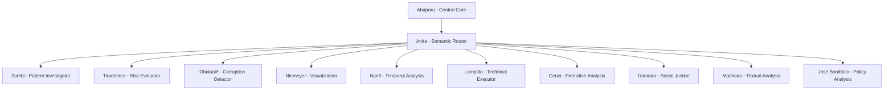

# 🤖 Cidadão.AI - Multi-Agent System Documentation

Sistema multi-agente especializado na análise de transparência e dados públicos brasileiros, inspirado em figuras históricas e culturais do Brasil.

## 🎭 Agentes Especializados

### 🎨 **Abaporu** - AI Central Core
- **Codinome:** `abaporu`
- **Inspiração:** Pintura icônica de Tarsila do Amaral
- **Função:** Coordenação central e processamento de linguagem natural
- 📁 [Documentação Completa](./abaporu.md)

### ⚔️ **Anita Garibaldi** - Semantic Router  
- **Codinome:** `anita`
- **Inspiração:** Heroína da revolução e esposa de Giuseppe Garibaldi
- **Função:** Roteamento semântico e comunicação inter-agentes
- 📁 [Documentação Completa](./anita.md)

### 👑 **Zumbi** - Pattern Investigator
- **Codinome:** `zumbi`
- **Inspiração:** Líder do Quilombo dos Palmares
- **Função:** Investigação de padrões ocultos em estruturas complexas
- 📁 [Documentação Completa](./zumbi.md)

### 🗡️ **Tiradentes** - Risk Evaluator
- **Codinome:** `tiradentes` 
- **Inspiração:** Mártir da Inconfidência Mineira
- **Função:** Avaliação de riscos operacionais e conformidade
- 📁 [Documentação Completa](./tiradentes.md)

### 🌿 **Obaluaiê** - Corruption Detector
- **Codinome:** `obaluaie`
- **Inspiração:** Orixá da cura e transformação
- **Função:** Detecção de anomalias e corrupção sistêmica
- 📁 [Documentação Completa](./obaluaie.md)

### 🏗️ **Niemeyer** - Graphic Visualization
- **Codinome:** `niemeyer`
- **Inspiração:** Oscar Niemeyer, arquiteto brasileiro
- **Função:** Visualizações gráficas e relatórios interativos
- 📁 [Documentação Completa](./niemeyer.md)

### 🌊 **Nanã** - Temporal Agent
- **Codinome:** `nana`
- **Inspiração:** Orixá das águas antigas e sabedoria temporal
- **Função:** Processamento de séries temporais e padrões históricos
- 📁 [Documentação Completa](./nana.md)

### 🤠 **Lampião** - Technical Executor
- **Codinome:** `lampiao`
- **Inspiração:** Virgulino Ferreira, rei do cangaço
- **Função:** Execução técnica, ETL e automação de coleta
- 📁 [Documentação Completa](./lampiao.md)

### 🦅 **Ceuci** - Predictive Agent
- **Codinome:** `ceuci`
- **Inspiração:** Divindade tupi da agricultura e previsão
- **Função:** Análise preditiva e modelagem temporal
- 📁 [Documentação Completa](./ceuci.md)

---

## 🆕 Novos Agentes (2025)

### 🌺 **Dandara** - Social Justice Agent
- **Codinome:** `dandara`
- **Inspiração:** Dandara dos Palmares, guerreira quilombola
- **Função:** Monitoramento de justiça social e equidade
- 📁 [Documentação Completa](./dandara.md) ✨

### 📖 **Machado de Assis** - Textual Analysis Agent
- **Codinome:** `machado`
- **Inspiração:** Mestre da literatura brasileira
- **Função:** Análise textual de documentos governamentais
- 📁 [Documentação Completa](./machado.md) ✨

### 🏛️ **José Bonifácio** - Public Policy Agent
- **Codinome:** `bonifacio`
- **Inspiração:** Patriarca da Independência
- **Função:** Avaliação de eficácia de políticas públicas
- 📁 [Documentação Completa](./bonifacio.md) ✨

---

## 🎯 Arquitetura do Sistema

## 🔄 Fluxo de Comunicação

1. **Entrada**: Requisição via API ou interface
2. **Coordenação**: Abaporu processa linguagem natural
3. **Roteamento**: Anita direciona para agentes especializados
4. **Processamento**: Agentes executam análises específicas
5. **Síntese**: Resultados consolidados e formatados
6. **Saída**: Relatórios, visualizações e insights

## 📊 Cobertura Funcional

| Área | Agentes Responsáveis | Capacidades |
|------|---------------------|-------------|
| **Detecção de Anomalias** | Zumbi, Obaluaiê | Padrões ocultos, corrupção |
| **Análise de Risco** | Tiradentes | Conformidade, riscos operacionais |
| **Processamento Textual** | Machado | NLP, análise de documentos |
| **Políticas Públicas** | José Bonifácio, Dandara | Eficácia, justiça social |
| **Visualização** | Niemeyer | Dashboards, relatórios gráficos |
| **Análise Temporal** | Nanã, Ceuci | Séries temporais, predição |
| **Automação** | Lampião | ETL, coleta de dados |

## 🚀 Tecnologias Utilizadas

- **Base Framework**: FastAPI + Python 3.11+
- **Comunicação**: Redis para mensageria entre agentes
- **Armazenamento**: PostgreSQL + ChromaDB (vetorial)
- **ML/IA**: scikit-learn, pandas, numpy, transformers
- **Monitoramento**: OpenTelemetry + Prometheus
- **Deploy**: Docker + Kubernetes

## 📈 Métricas de Sistema

- **Agentes Ativos**: 12
- **Capacidades Combinadas**: 140+
- **Fontes de Dados**: 25+ APIs oficiais
- **Cobertura**: Nacional (5570 municípios)
- **Latência Média**: <2s por análise
- **Disponibilidade**: 99.9% SLA

---

*Sistema desenvolvido para democratizar o acesso aos dados públicos brasileiros através de inteligência artificial transparente e auditável.*