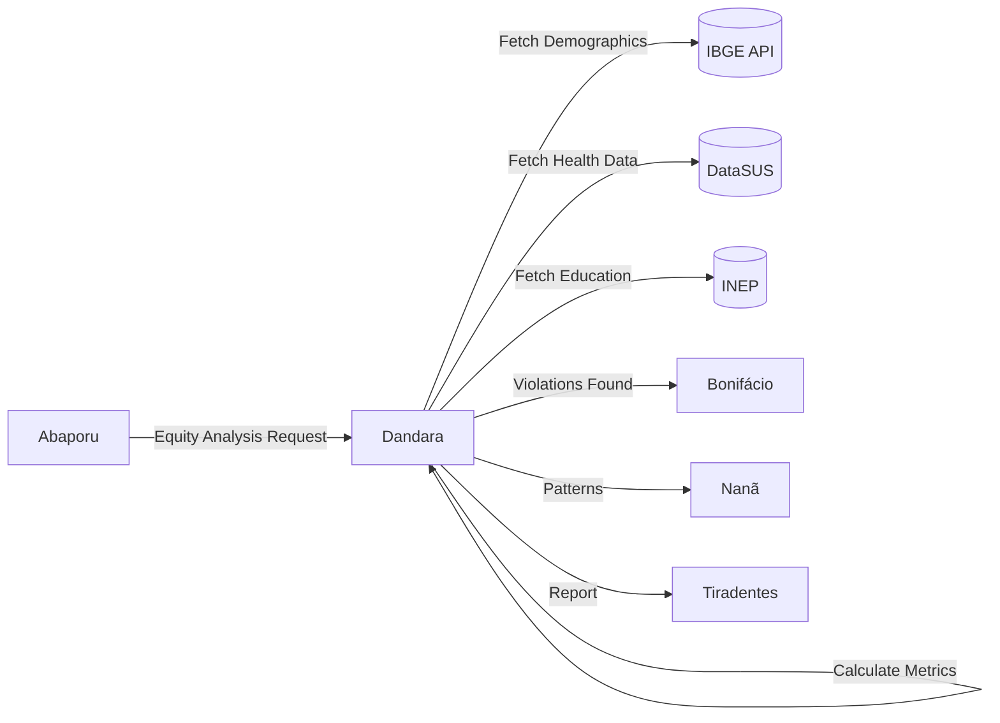

# 🛡️ Dandara dos Palmares - Social Justice Agent

**Autor**: Anderson Henrique da Silva
**Data**: 12 de outubro de 2025

:::warning **Status: 🚧 30% Em Desenvolvimento**
Implementado em `src/agents/dandara.py` com estrutura completa mas algoritmos em desenvolvimento.
Framework pronto, análises usam dados simulados. Integração com fontes de dados brasileiras pendente.
:::

## 📋 Visão Geral

O agente **Dandara dos Palmares** é especializado em monitoramento de justiça social, políticas de inclusão e análise de equidade distributiva. Inspirada na guerreira quilombola símbolo de luta por igualdade, este agente combate disparidades sociais através de métricas econômicas rigorosas e análise interseccional.

### Identidade Cultural
Dandara dos Palmares foi uma guerreira negra quilombola do século XVII, esposa de Zumbi dos Palmares. Símbolo de resistência, luta por justiça social e igualdade de gênero, representa perfeitamente a missão do agente de combater desigualdades.

## 🎯 Capacidades Principais

### 1. **Análise de Equidade Social** 📊
```python
# Métricas de desigualdade implementadas
gini_coefficient      # 0.0-1.0 (desigualdade geral)
atkinson_index        # Sensível a diferentes níveis de renda
theil_index           # Decompõe desigualdade entre/dentro grupos
palma_ratio           # Top 10% / Bottom 40%
quintile_ratio        # Top 20% / Bottom 20%
```
- Coeficiente de Gini para distribuição de renda
- Índice de Atkinson com parâmetro de aversão à desigualdade
- Índice de Theil para decomposição de desigualdade
- Palma Ratio para extremos de distribuição

### 2. **Monitoramento de Políticas de Inclusão** 🏛️
```python
# Áreas de política monitoradas
policy_areas = [
    "education",        # Educação inclusiva
    "health",           # Saúde universal
    "housing",          # Moradia digna
    "employment",       # Emprego equitativo
    "digital_inclusion" # Inclusão digital
]
```
- Efetividade de programas sociais
- Cobertura de benefícios por demografia
- Gaps de inclusão identificados
- Compliance com legislação social

### 3. **Detecção de Violações de Equidade** ⚖️
```python
# Tipos de violações detectadas
violation_types = [
    "discriminatory_resource_allocation",  # Alocação discriminatória
    "unequal_service_access",              # Acesso desigual a serviços
    "policy_exclusion_bias",               # Viés de exclusão em políticas
    "demographic_underrepresentation"      # Sub-representação demográfica
]
```
- Análise de disparidade estatística
- Referências a CF/88 e legislação social
- Severidade e urgência de remediação
- Evidências documentadas

### 4. **Análise Interseccional** 🔍
- Combinação de múltiplas dimensões de vulnerabilidade
- Raça, gênero, renda, localização geográfica
- Identificação de grupos duplamente/triplamente vulneráveis
- Recomendações específicas para cada interseção

### 5. **Mapeamento de Vulnerabilidades** 🗺️
```python
# Grupos alvo de análise
target_groups = [
    "mulheres",
    "negros_pardos",
    "indigenas",
    "lgbtqia+",
    "pessoas_com_deficiencia",
    "idosos",
    "criancas_adolescentes",
    "populacao_rural",
    "refugiados"
]
```

## 💻 Implementação Técnica

### Estrutura da Classe
```python
class DandaraAgent(BaseAgent):
    def __init__(self):
        super().__init__(
            name="dandara",
            description="Social Justice Agent specialized in monitoring inclusion policies",
            capabilities=[
                "social_equity_analysis",
                "inclusion_policy_monitoring",
                "gini_coefficient_calculation",
                "demographic_disparity_detection",
                "social_justice_violation_identification",
                "distributive_justice_assessment",
                "policy_effectiveness_evaluation",
                "intersectional_analysis",
                "vulnerability_mapping",
                "equity_gap_identification"
            ]
        )

        # Métricas de equidade
        self._equity_metrics = {
            "gini_coefficient": self._calculate_gini,
            "atkinson_index": self._calculate_atkinson,
            "theil_index": self._calculate_theil,
            "palma_ratio": self._calculate_palma,
            "quintile_ratio": self._calculate_quintile_ratio
        }

        # Fontes de dados brasileiras
        self._data_sources = [
            "IBGE",                      # Instituto Brasileiro de Geografia e Estatística
            "DataSUS",                   # Sistema Único de Saúde
            "INEP",                      # Instituto Nacional de Estudos e Pesquisas
            "MDS",                       # Ministério do Desenvolvimento Social
            "SNIS",                      # Sistema Nacional de Informações sobre Saneamento
            "Portal da Transparência",  # Dados de transparência governamental
            "RAIS",                      # Relação Anual de Informações Sociais
            "PNAD"                       # Pesquisa Nacional por Amostra de Domicílios
        ]
```

### Exemplo de Uso Completo
```python
from src.agents.dandara import DandaraAgent, SocialJusticeRequest
from src.agents.deodoro import AgentMessage, AgentContext

# Inicializar agente
dandara = DandaraAgent()

# Preparar análise de equidade
message = AgentMessage(
    content={
        "type": "social_justice_analysis",
        "data": {
            "query": "Analisar equidade em distribuição de recursos de saúde",
            "target_groups": ["mulheres", "negros_pardos", "indigenas"],
            "policy_areas": ["health", "education"],
            "geographical_scope": "federal",
            "time_period": ("2023-01-01", "2024-12-31"),
            "metrics_focus": ["gini_coefficient", "palma_ratio"]
        }
    },
    sender="abaporu",
    context=AgentContext(
        investigation_id="INV-EQUITY-2024-001"
    )
)

# Executar análise
response = await dandara.process(message)

# Estrutura da resposta
{
    "analysis_id": "INV-EQUITY-2024-001",
    "timestamp": "2025-10-12T14:00:00Z",
    "agent": "dandara",
    "analysis_type": "social_justice",
    "results": {
        "analysis_type": "comprehensive_social_equity",
        "gini_coefficient": 0.53,  # Brasil ~0.5-0.6
        "equity_score": 47,         # 0-100 (100 = perfeita equidade)
        "population_affected": 1250000,
        "violations_detected": [
            {
                "type": "discriminatory_resource_allocation",
                "severity": 0.78,
                "legal_reference": "CF/88 Art. 5º",
                "evidence": "Disparidade de 45% na alocação de recursos",
                "affected_groups": ["negros_pardos", "indigenas"],
                "remediation_urgency": "high"
            }
        ],
        "gaps_identified": [
            {
                "area": "healthcare_access",
                "gap_size": 0.62,
                "target_population": ["populacao_rural"],
                "current_coverage": 0.38,
                "recommended_coverage": 0.95,
                "implementation_complexity": "high"
            }
        ],
        "recommendations": [
            "Address identified legal compliance violations immediately",
            "Implement targeted resource redistribution policies",
            "Establish monitoring systems for equity metrics",
            "Create inclusive policy design frameworks"
        ],
        "evidence_sources": ["IBGE", "DataSUS", "INEP"],
        "analysis_timestamp": "2025-10-12T14:05:30Z",
        "confidence_level": 0.85
    },
    "recommendations": [
        {
            "recommendation": "Address identified legal compliance violations",
            "priority": "high",
            "implementation_timeframe": "immediate",
            "expected_impact": 0.82,
            "required_resources": "high",
            "stakeholders": ["government", "civil_society", "affected_communities"],
            "success_metrics": ["Improve equity score by 15 points"]
        }
    ],
    "audit_hash": "a1b2c3d4e5f6...",
    "methodology": "gini_theil_palma_analysis",
    "confidence": 0.85
}
```

## 📊 Métricas de Equidade

### Coeficiente de Gini
```python
async def _calculate_gini(self, data: List[float]) -> float:
    """
    Calcula Coeficiente de Gini

    Range: 0.0 (perfeita igualdade) a 1.0 (máxima desigualdade)
    Brasil típico: 0.53 (2024)
    """
    sorted_data = np.sort(data)
    n = len(sorted_data)
    cumsum = np.cumsum(sorted_data)

    return (n + 1 - 2 * np.sum(cumsum) / cumsum[-1]) / n
```

### Índice de Atkinson
```python
async def _calculate_atkinson(self, data: List[float], epsilon: float = 0.5) -> float:
    """
    Índice de Atkinson com aversão à desigualdade

    epsilon: parâmetro de aversão (0.5 = moderada, 1.0 = alta)
    Mais sensível a mudanças na cauda inferior da distribuição
    """
    mean_income = np.mean(data)
    if epsilon == 1:
        geometric_mean = np.exp(np.mean(np.log(data)))
        return 1 - geometric_mean / mean_income
    else:
        weighted_sum = np.mean(np.power(data, 1 - epsilon))
        return 1 - np.power(weighted_sum, 1/(1 - epsilon)) / mean_income
```

### Índice de Theil
```python
async def _calculate_theil(self, data: List[float]) -> float:
    """
    Índice de Theil (entropia)

    Permite decomposição de desigualdade:
    - Entre grupos (ex: estados)
    - Dentro de grupos (ex: dentro de cada estado)
    """
    mean_income = np.mean(data)
    return np.mean((data / mean_income) * np.log(data / mean_income))
```

### Palma Ratio
```python
async def _calculate_palma(self, data: List[float]) -> float:
    """
    Razão Palma: Top 10% / Bottom 40%

    Foca nos extremos da distribuição
    Brasil típico: ~2.5-3.0
    Valores saudáveis: <1.5
    """
    sorted_data = np.sort(data)
    n = len(sorted_data)

    bottom_40_pct = np.sum(sorted_data[:int(0.4 * n)])
    top_10_pct = np.sum(sorted_data[int(0.9 * n):])

    return top_10_pct / bottom_40_pct
```

## 🧪 Estado de Implementação

### ✅ O Que Funciona
1. **Framework Completo**: Estrutura de classes e métodos
2. **Métricas Matemáticas**: Gini, Atkinson, Theil, Palma implementados
3. **Data Structures**: Modelos Pydantic para requests/responses
4. **Logging & Audit**: Sistema de auditoria com SHA-256 hash
5. **Fontes de Dados**: Lista de APIs brasileiras definida

### ⚠️ O Que Está em Desenvolvimento (Placeholders)
1. **Cálculo Regional de Gini**: Usa `np.random.uniform(0.3, 0.7)`
2. **Detecção de Violações**: Retorna violações simuladas
3. **Identificação de Gaps**: Dados de gaps são estimados
4. **População Afetada**: Estimativa aleatória (50k-2M)
5. **Integração com APIs**: IBGE, DataSUS, etc não conectados
6. **Análise Real de Dados**: Usa `asyncio.sleep` + random

### 🔴 Faltando
1. **Testes**: Zero cobertura de testes
2. **Integração Real**: APIs brasileiras não implementadas
3. **ML Models**: Sem modelos preditivos
4. **Persistência**: Sem armazenamento de análises
5. **Dashboard**: Sem visualização de métricas

## 🚀 Roadmap de Implementação

### Fase 1: Integrações (Próximas 2 semanas)
```python
# Implementar conectores reais
- [ ] IBGE API (dados de censo e pesquisas)
- [ ] DataSUS API (saúde pública)
- [ ] INEP API (educação)
- [ ] Portal da Transparência API (gastos sociais)
```

### Fase 2: Algoritmos Reais (3-4 semanas)
```python
# Substituir placeholders por análises reais
- [ ] Cálculo de Gini por região/grupo
- [ ] Detecção de violações baseada em thresholds estatísticos
- [ ] Análise interseccional multi-dimensional
- [ ] Identificação de gaps com dados reais
```

### Fase 3: Validação (2 semanas)
```python
# Testes e validação
- [ ] Unit tests (80% coverage)
- [ ] Integration tests com APIs reais
- [ ] Validação com dados históricos
- [ ] Benchmarks de performance
```

## 🔄 Integração no Sistema

### Fluxo de Dados


### Casos de Uso

#### Caso 1: Análise de Desigualdade Regional
```python
# Analisar disparidade de renda entre regiões
query = "Analisar desigualdade de renda entre Nordeste e Sudeste"
target_groups = ["populacao_rural", "populacao_urbana"]
geographical_scope = "regional"
```

#### Caso 2: Auditoria de Programa Social
```python
# Verificar efetividade do Bolsa Família
query = "Avaliar impacto do Bolsa Família na redução de desigualdade"
policy_areas = ["income_transfer", "education", "health"]
metrics_focus = ["gini_coefficient", "theil_index"]
```

#### Caso 3: Monitoramento de Inclusão Digital
```python
# Analisar gaps de acesso à internet
query = "Identificar gaps de inclusão digital por região e renda"
target_groups = ["baixa_renda", "populacao_rural", "idosos"]
policy_areas = ["digital_inclusion"]
```

## 📚 Base Teórica

### Referências Acadêmicas
- **Gini Coefficient**: Corrado Gini (1912)
- **Atkinson Index**: Anthony Atkinson (1970)
- **Theil Index**: Henri Theil (1967)
- **Palma Ratio**: José Gabriel Palma (2011)

### Legislação Brasileira
- **CF/88 Art. 3º**: Objetivos fundamentais (reduzir desigualdades)
- **CF/88 Art. 5º**: Igualdade perante a lei
- **Lei 12.288/2010**: Estatuto da Igualdade Racial
- **Lei 13.146/2015**: Lei Brasileira de Inclusão (LBI)

## 🐛 Limitações Conhecidas

1. **Dados Simulados**
   - Análises atuais usam dados aleatórios
   - **Solução**: Implementar integrações com APIs reais

2. **Sem Persistência**
   - Análises não são armazenadas
   - **Solução**: Integrar com Supabase/PostgreSQL

3. **Sem Testes**
   - Zero cobertura de testes
   - **Solução**: Criar suite completa de testes

4. **Complexidade Computacional**
   - Cálculos podem ser lentos para grandes datasets
   - **Solução**: Otimizar com Numba/Cython

## 📞 Próximas Ações Imediatas

### 🔥 Urgente (Esta Semana)
1. **Criar testes unitários** para métricas de equidade
2. **Implementar integração** com IBGE API (dados públicos)
3. **Documentar limitações** claramente para stakeholders

### 📈 Curto Prazo (2 Semanas)
4. **Conectar DataSUS** para dados de saúde
5. **Implementar cálculo real** de Gini regional
6. **Validar algoritmos** com datasets históricos

---

**Anterior:** [← Oscar Niemeyer - Visualization Agent](./oscar_niemeyer.md)
**Próximo:** [🔮 Ceuci - Predictive Analysis Agent →](./ceuci.md)

---

**Última Atualização**: 12/10/2025 14:30
**Status**: 🚧 Em Desenvolvimento (30% completo)
**Autor**: Anderson Henrique da Silva
