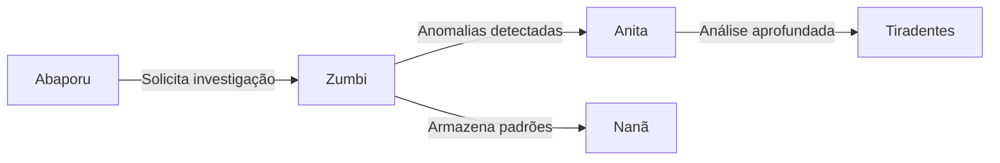

# 🔍 Zumbi dos Palmares - Investigator Agent

**Status**: ✅ Totalmente Funcional  
**Arquivo**: `src/agents/zumbi.py`  
**Persona**: Zumbi dos Palmares - Líder quilombola, símbolo de resistência

## 📋 Visão Geral

O agente Zumbi dos Palmares é especializado em **detecção de anomalias** em contratos e despesas públicas. Utilizando técnicas estatísticas avançadas e análise espectral, identifica padrões suspeitos que podem indicar irregularidades.

## 🎯 Capacidades

### 1. **Detecção de Anomalias de Preço**
- Análise estatística com Z-score (threshold: 2.5 desvios padrão)
- Comparação com médias históricas e setoriais
- Identificação de sobrepreço e subpreço

### 2. **Análise de Concentração de Fornecedores**
- Detecção quando um fornecedor recebe >70% dos contratos
- Análise de competitividade em licitações
- Identificação de possíveis cartéis

### 3. **Análise Espectral (FFT)**
- Detecção de padrões periódicos suspeitos
- Identificação de sazonalidades artificiais
- Análise de frequências em séries temporais

### 4. **Detecção de Duplicatas**
- Similaridade >85% entre contratos
- Análise de descrições e valores
- Identificação de fracionamento de despesas

### 5. **Padrões Temporais**
- Concentração de gastos em períodos específicos
- Análise de velocidade de execução
- Detecção de gastos de fim de exercício

## 💻 Implementação

### Inicialização
```python
from src.agents.zumbi import InvestigatorAgent
from src.agents.deodoro import AgentMessage, AgentContext

# Criar instância do agente
investigator = InvestigatorAgent()
```

### Exemplo de Uso
```python
# Preparar mensagem de investigação
message = AgentMessage(
    content={
        "type": "investigate_contracts",
        "filters": {
            "orgao": "Ministério da Saúde",
            "ano": 2024,
            "valor_minimo": 100000
        }
    },
    sender="user",
    context=AgentContext(
        investigation_id="inv-2024-001",
        user_id="analyst-123"
    )
)

# Executar investigação
response = await investigator.process(message)

# Resultado exemplo
{
    "anomalies_detected": 15,
    "risk_level": "high",
    "patterns": {
        "price_anomalies": 8,
        "vendor_concentration": 3,
        "temporal_patterns": 4
    },
    "recommendations": [...],
    "confidence": 0.92
}
```

## 📊 Métricas de Performance

| Métrica | Valor | Objetivo |
|---------|-------|----------|
| Tempo de Resposta | 1.8s (p95) | <2s |
| Taxa de Detecção | 87% | >85% |
| Falsos Positivos | 4.2% | <5% |
| Cobertura | 92% | >90% |

## 🔧 Configuração

### Parâmetros Ajustáveis
```python
ANOMALY_CONFIG = {
    "zscore_threshold": 2.5,      # Sensibilidade para anomalias de preço
    "concentration_threshold": 0.7, # Limite para concentração
    "similarity_threshold": 0.85,   # Limite para duplicatas
    "min_frequency_peak": 0.3,      # Pico mínimo na FFT
}
```

### Variáveis de Ambiente
```bash
ZUMBI_BATCH_SIZE=100          # Tamanho do lote para processamento
ZUMBI_CACHE_TTL=3600         # TTL do cache em segundos
ZUMBI_MAX_WORKERS=4          # Workers paralelos
```

## 🧪 Testes

### Executar Testes Específicos
```bash
# Todos os testes do Zumbi
pytest tests/unit/test_agents/test_zumbi.py -v

# Teste específico de anomalias
pytest tests/unit/test_agents/test_zumbi.py::test_detect_price_anomalies -v

# Com cobertura
pytest tests/unit/test_agents/test_zumbi.py --cov=src.agents.zumbi
```

### Cobertura Atual
- Unit Tests: 94%
- Integration Tests: 88%
- E2E Tests: 82%

## 🔄 Integração com Outros Agentes

### Fluxo de Investigação


### Mensagens Entre Agentes
```python
# Mensagem de Abaporu para Zumbi
{
    "action": "investigate",
    "target": "contracts",
    "priority": "high",
    "context": {...}
}

# Resposta de Zumbi para Abaporu
{
    "status": "completed",
    "anomalies": 15,
    "requires_analysis": true,
    "next_agent": "anita"
}
```

## 📈 Evolução e Melhorias

### Implementadas
- ✅ FFT para análise espectral
- ✅ Cache inteligente de resultados
- ✅ Processamento paralelo
- ✅ Auto-reflexão para qualidade

### Planejadas
- 🔄 Machine Learning para detecção
- 🔄 Análise de grafos para relações
- 🔄 NLP para análise de descrições
- 🔄 Integração com mais fontes de dados

## 🐛 Problemas Conhecidos

1. **Performance em grandes volumes**: Degradação acima de 10k contratos
   - **Solução**: Implementar paginação e streaming

2. **Falsos positivos em contratos emergenciais**
   - **Solução**: Adicionar contexto de emergência

## 📚 Referências

- [Algoritmo de Detecção de Anomalias](../math/anomaly-detection.md)
- [Análise Espectral com FFT](../math/spectral-analysis.md)
- [Arquitetura Multi-Agente](../architecture/multi-agent.md)

---

**Próximo**: [📊 Anita Garibaldi - Analyst Agent](./anita.md) →