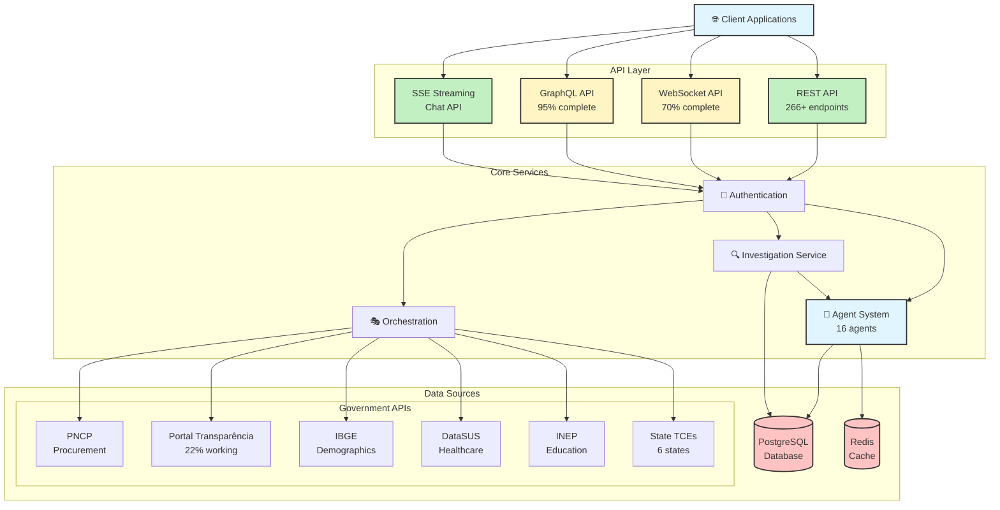

# 🌐 API Documentation Index

**Last Updated**: 2025-11-08
**Production URL**: https://cidadao-api-production.up.railway.app

---

## 📑 Quick Navigation

### Core API Documentation
- **[README.md](README.md)** - Main API documentation overview
- **[API_ENDPOINTS_MAP.md](API_ENDPOINTS_MAP.md)** - Complete endpoints catalog (266+ endpoints)
- **[API_VERSIONING_STRATEGY.md](API_VERSIONING_STRATEGY.md)** - API versioning approach

### Integration Guides
- **[PORTAL_TRANSPARENCIA_INTEGRATION.md](PORTAL_TRANSPARENCIA_INTEGRATION.md)** - Portal da Transparência integration
- **[ECOSISTEMA_COMPLETO_APIS_BRASIL.md](ECOSISTEMA_COMPLETO_APIS_BRASIL.md)** - Brazilian government APIs ecosystem (30+ APIs)
- **[MULTI_API_INTEGRATION.md](../architecture/MULTI_API_INTEGRATION.md)** - Multi-API orchestration

---

## 💬 Chat & Communication APIs

### REST Chat
- **[CHAT_API_DOCUMENTATION.md](CHAT_API_DOCUMENTATION.md)** - Chat API with Server-Sent Events (SSE)
- **[BACKEND_CHAT_IMPLEMENTATION.md](BACKEND_CHAT_IMPLEMENTATION.md)** - Backend implementation details
- **[MARITACA_DIRECT_CHAT_API.md](MARITACA_DIRECT_CHAT_API.md)** - Maritaca AI integration

### Real-time Communication
- **[WEBSOCKET_API_DOCUMENTATION.md](WEBSOCKET_API_DOCUMENTATION.md)** - WebSocket API reference
- **[WEBSOCKET_IMPLEMENTATION_STATUS.md](WEBSOCKET_IMPLEMENTATION_STATUS.md)** - Implementation status (70% complete)

### GraphQL
- **[GRAPHQL_IMPLEMENTATION.md](GRAPHQL_IMPLEMENTATION.md)** - GraphQL API (95% complete)
  - Schema with types (User, Investigation, Finding, Anomaly, Contract)
  - Queries, mutations, and subscriptions
  - Playground at `/graphql/playground`

---

## 📊 Status & Monitoring

### Integration Status
- **[API_INTEGRATION_STATUS.md](API_INTEGRATION_STATUS.md)** - Overall integration status
- **[ENDPOINTS_CONNECTION_STATUS.md](ENDPOINTS_CONNECTION_STATUS.md)** - Endpoint health status

### Metrics & Monitoring
- **[AGENT_METRICS_DASHBOARD.md](AGENT_METRICS_DASHBOARD.md)** - Prometheus & Grafana dashboards
  - Real-time metrics collection
  - Agent performance monitoring
  - API endpoint for metrics

---

## 🏗️ API Architecture Diagram

---

## 🔌 API Categories

### Investigation APIs
- `/api/v1/investigations/` - CRUD operations for investigations
- `/api/v1/chat/` - Conversational interface
- `/api/v1/agents/` - Direct agent invocation

### Government Data APIs
- `/api/v1/federal/` - Federal APIs (IBGE, DataSUS, INEP, PNCP)
- `/api/v1/transparency/` - Portal da Transparência
- `/api/v1/tce/` - State TCE endpoints (6 states)

### Supabase Integration
- **[supabase-rest.md](supabase-rest.md)** - Supabase REST API integration

---

## 🚀 API Endpoints Overview

| Category | Count | Status |
|----------|-------|--------|
| **Total Endpoints** | 266+ | ✅ Operational |
| **Investigation** | 15 | ✅ Complete |
| **Chat/Agents** | 20 | ✅ Complete |
| **Federal Data** | 35+ | ✅ Integrated |
| **Transparency** | 8 (22% working) | ⚠️ Limited |
| **WebSocket** | 5 | 🟡 70% Complete |
| **GraphQL** | 12 | 🟡 95% Complete |

---

## 📝 Integration Status

### Working Integrations (30+ APIs)
- ✅ IBGE - Demographics and geographic data
- ✅ DataSUS - Healthcare data
- ✅ INEP - Education data
- ✅ PNCP - Public procurement (new platform)
- ✅ 6 State TCE APIs - Court of Accounts
- ⚠️ Portal da Transparência - 22% endpoints working (78% return 403)

### Real-time Features
- ✅ Server-Sent Events (SSE) - Chat streaming
- 🟡 WebSocket - 70% implemented
- 🟡 GraphQL Subscriptions - 95% implemented

---

## 🔗 Related Documentation

- **[../architecture/ORCHESTRATION_SYSTEM.md](../architecture/ORCHESTRATION_SYSTEM.md)** - API orchestration
- **[../deployment/railway/README.md](../deployment/railway/README.md)** - Production deployment
- **[../testing/](../testing/)** - API testing documentation

---

## 📋 Quick Reference

### Authentication
- JWT tokens for user authentication
- API keys for service-to-service
- IP whitelist for production

### Rate Limiting
- Per-user limits configured
- Per-IP limits for anonymous requests
- Agent pool management for concurrent requests

### Response Formats
- JSON (default)
- Server-Sent Events (SSE) for chat
- GraphQL for flexible queries

---

**Swagger UI**: https://cidadao-api-production.up.railway.app/docs
**GraphQL Playground**: https://cidadao-api-production.up.railway.app/graphql/playground
