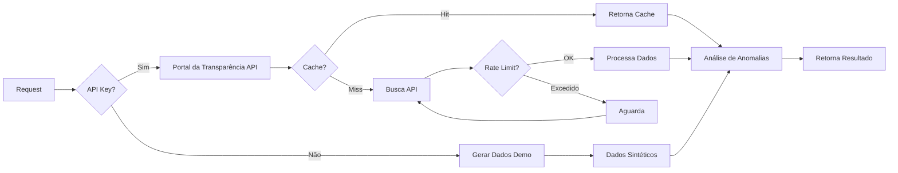

# 🌐 Integração com Portal da Transparência

**Autor**: Anderson Henrique da Silva
**Localização**: Minas Gerais, Brasil
**Última Atualização**: 2025-10-13 15:15:18 -0300

---

**Status**: ✅ Totalmente Implementada
**Modo de Operação**: Híbrido (API Real + Demo)

## 📋 Visão Geral

O Cidadão.AI possui integração completa com o [Portal da Transparência](https://www.portaldatransparencia.gov.br/) do Governo Federal, permitindo análise de dados reais de contratos, despesas, licitações e servidores públicos.

## 🔑 Modos de Operação

### 1. **Modo Produção** (Com API Key)
- Acessa dados reais e atualizados
- Análise de contratos de múltiplos órgãos
- Rate limiting inteligente (90 req/min)
- Cache de 1 hora para otimização

### 2. **Modo Demo** (Sem API Key)
- Dados sintéticos para demonstração
- Funcionalidade completa do sistema
- Indicação clara "[DEMO]" nos resultados
- Ideal para testes e desenvolvimento

## 🚀 Como Configurar

### Passo 1: Obter API Key (Opcional)

1. Acesse https://www.portaldatransparencia.gov.br/api-de-dados
2. Clique em "Cadastre-se"
3. Preencha o formulário
4. Receba a chave por email

### Passo 2: Configurar Ambiente

#### Opção A: Arquivo `.env` (Recomendado)
```bash
# .env
TRANSPARENCY_API_KEY=sua-chave-aqui
```

#### Opção B: Variável de Ambiente
```bash
export TRANSPARENCY_API_KEY=sua-chave-aqui
```

#### Opção C: Docker
```bash
docker run -e TRANSPARENCY_API_KEY=sua-chave-aqui ...
```

### Passo 3: Verificar Configuração
```bash
# Executar aplicação
python app.py

# Verificar logs
# Com API key: "Using real Portal da Transparência data"
# Sem API key: "Portal da Transparência API key not configured, using demo data"
```

## 🔧 Configurações Avançadas

### Parâmetros Configuráveis
```python
# src/core/config.py
transparency_api_base_url: str = "https://api.portaldatransparencia.gov.br"
transparency_api_timeout: int = 30  # segundos
transparency_api_max_retries: int = 3
transparency_api_rate_limit: int = 90  # requests/minuto
transparency_cache_ttl: int = 3600  # 1 hora
```

### Endpoints Disponíveis
- `/api-de-dados/contratos` - Contratos públicos
- `/api-de-dados/despesas` - Despesas executadas
- `/api-de-dados/convenios` - Convênios
- `/api-de-dados/licitacoes` - Processos licitatórios
- `/api-de-dados/servidores` - Servidores públicos

## 📊 Uso no Sistema

### Cliente API (`src/tools/transparency_api.py`)

```python
from src.tools.transparency_api import TransparencyAPIClient, TransparencyAPIFilter

# Cliente detecta automaticamente se há API key
async with TransparencyAPIClient() as client:
    # Filtros de busca
    filters = TransparencyAPIFilter(
        codigo_orgao="26000",  # Ministério da Saúde
        ano=2024,
        mes=1,
        valor_inicial=100000
    )

    # Buscar contratos
    response = await client.get_contracts(filters)

    # Response inclui metadados
    if response.is_demo:
        print("Usando dados de demonstração")
    else:
        print(f"Dados reais: {response.total_records} contratos")
```

### Análise de Anomalias

O sistema analisa automaticamente:
- **Anomalias de Preço**: Z-score > 1.5
- **Concentração de Fornecedores**: > 25% do valor total
- **Padrões Temporais**: Gastos suspeitos no fim do exercício
- **Contratos Duplicados**: Similaridade > 85%

## 🔒 Segurança

### Proteção da API Key
- Nunca é logada ou exposta
- Armazenada como `SecretStr` (Pydantic)
- Não incluída em mensagens de erro
- Não enviada ao frontend

### Headers de Autenticação
```python
headers = {
    "chave-api-dados": "***"  # Valor mascarado nos logs
}
```

## 📈 Métricas e Monitoramento

### Cache Performance
```python
# Métricas rastreadas
cache_hits: Counter
cache_misses: Counter
api_calls: Counter
api_errors: Counter
response_time: Histogram
```

### Logs Detalhados
```
INFO: Fetching contracts from Portal da Transparência (real data)
INFO: Cache hit for key: contracts_26000_2024_1
INFO: Found 15 anomalies in 127 contracts
```

## 🚨 Tratamento de Erros

### Rate Limiting
```python
# Aguarda automaticamente quando necessário
WARNING: Rate limit reached, waiting 15.3 seconds
INFO: Resuming after rate limit wait
```

### Fallback Automático
```python
# Se API falhar, usa modo demo
ERROR: Portal da Transparência API error: 503
WARNING: Falling back to demo data
```

## 🧪 Testando a Integração

### Modo Demo (Sem API Key)
```bash
# Remove a variável temporariamente
unset TRANSPARENCY_API_KEY
python app.py
# Acesse http://localhost:7860
# Resultados mostrarão "[DEMO]"
```

### Modo Produção (Com API Key)
```bash
# Configure a chave
export TRANSPARENCY_API_KEY=sua-chave-aqui
python app.py
# Resultados serão dados reais
```

### Verificar Endpoints
```bash
# Health check
curl http://localhost:7860/health

# Investigar com Zumbi
curl -X POST http://localhost:7860/api/agents/zumbi/investigate \
  -H "Content-Type: application/json" \
  -d '{"orgao": "26000", "ano": 2024}'
```

## 📊 Exemplos de Resposta

### Modo Produção (Dados Reais)
```json
{
  "status": "completed",
  "source": "portal_transparencia_api",
  "data_freshness": "2024-01-15T10:30:00Z",
  "contracts_analyzed": 342,
  "anomalies_found": 27,
  "confidence": 0.89,
  "cache_hit": false
}
```

### Modo Demo
```json
{
  "status": "completed_fallback",
  "source": "demo_data",
  "warning": "[DEMO] Using demonstration data",
  "contracts_analyzed": 10,
  "anomalies_found": 3,
  "confidence": 0.75,
  "demo_mode": true
}
```

## 🔄 Fluxo de Dados



## 📚 Recursos Adicionais

- [Documentação da API](https://www.portaldatransparencia.gov.br/swagger-ui.html)
- [Dicionário de Dados](https://www.portaldatransparencia.gov.br/pagina-interna/603578-dicionario-de-dados)
- [Termos de Uso](https://www.portaldatransparencia.gov.br/pagina-interna/603421-termos-de-uso)

---

**Nota**: Este sistema foi desenvolvido para promover transparência e accountability no uso de recursos públicos.
