# 🏛️ Arquitetura Multi-Agente - Cidadão.AI

**Autor**: Anderson Henrique da Silva
**Data**: 12 de outubro de 2025
**Versão**: 2.0

---

## 📋 Índice

1. [Visão Geral do Sistema](#visão-geral-do-sistema)
2. [Arquitetura de Agentes](#arquitetura-de-agentes)
3. [Fluxo de Investigação](#fluxo-de-investigação)
4. [Comunicação Entre Agentes](#comunicação-entre-agentes)
5. [Pipeline de Dados](#pipeline-de-dados)
6. [Integração Frontend-Backend](#integração-frontend-backend)
7. [Deploy e Infraestrutura](#deploy-e-infraestrutura)

---

## 1. Visão Geral do Sistema

### Diagrama do Ecossistema Completo

```mermaid
graph TB
    subgraph "Usuário"
        U[👤 Cidadão]
    end

    subgraph "Frontend Layer"
        HUB[🏛️ Hub<br/>Landing Page]
        APP[⚛️ Frontend<br/>Next.js PWA]
        DOCS[📚 Docs<br/>Docusaurus]
    end

    subgraph "Backend Layer - FastAPI"
        API[🔌 API Gateway<br/>FastAPI]
        CHAT[💬 Chat Service<br/>SSE Streaming]
        ROUTER[🎯 Agent Router<br/>Senna]
    end

    subgraph "Multi-Agent System - 17 Agentes"
        MASTER[👑 Abaporu<br/>Master Orchestrator]

        subgraph "Análise e Investigação"
            ZUMBI[⚔️ Zumbi<br/>Anomaly Detective]
            ANITA[📊 Anita<br/>Data Analyst]
            OXOSSI[🏹 Oxóssi<br/>Fraud Hunter]
            LAMPIAO[🗺️ Lampião<br/>Regional Analyst]
        end

        subgraph "Inteligência e Predição"
            CEUCI[🔮 Ceuci<br/>Predictive AI]
            OBALUAIE[🕵️ Obaluaie<br/>Corruption Detector]
        end

        subgraph "Comunicação e Relatórios"
            DRUMMOND[📢 Drummond<br/>Communicator]
            TIRADENTES[📝 Tiradentes<br/>Report Writer]
            NIEMEYER[🎨 Niemeyer<br/>Visualizer]
        end

        subgraph "Segurança e Compliance"
            MARIA[🛡️ Maria Quitéria<br/>Security Guardian]
            BONIFACIO[⚖️ Bonifácio<br/>Legal Expert]
            DANDARA[⚖️ Dandara<br/>Social Justice]
        end

        subgraph "Suporte e Memória"
            SENNA[🎯 Senna<br/>Router]
            NANA[🧠 Nanã<br/>Memory Manager]
            MACHADO[✍️ Machado<br/>Narrative Analyst]
            DEODORO[🏗️ Deodoro<br/>Base Architecture]
        end
    end

    subgraph "Data Sources"
        PORTAL[🏛️ Portal da<br/>Transparência]
        IBGE[📊 IBGE<br/>Dados Demográficos]
        DATASUS[🏥 DataSUS<br/>Saúde Pública]
        INEP[🎓 INEP<br/>Educação]
    end

    subgraph "Infrastructure"
        DB[(🗄️ PostgreSQL<br/>Supabase)]
        CACHE[(⚡ Redis<br/>Cache)]
        LLM[🤖 Groq API<br/>LLM Service]
    end

    subgraph "Monitoring"
        PROM[📊 Prometheus]
        GRAF[📈 Grafana]
    end

    %% User interactions
    U --> HUB
    U --> APP
    U --> DOCS

    %% Frontend to Backend
    HUB --> API
    APP --> API
    APP --> CHAT

    %% API to Agents
    API --> ROUTER
    CHAT --> ROUTER
    ROUTER --> MASTER
    ROUTER --> SENNA

    %% Master orchestration
    MASTER --> ZUMBI
    MASTER --> ANITA
    MASTER --> OXOSSI
    MASTER --> LAMPIAO
    MASTER --> CEUCI
    MASTER --> OBALUAIE
    MASTER --> TIRADENTES

    %% Agent interactions
    ZUMBI --> OXOSSI
    ANITA --> LAMPIAO
    ANITA --> CEUCI
    OXOSSI --> OBALUAIE
    TIRADENTES --> DRUMMOND
    TIRADENTES --> NIEMEYER

    %% Security and compliance
    MARIA -.-> MASTER
    MARIA -.-> ZUMBI
    BONIFACIO -.-> TIRADENTES
    DANDARA -.-> ANITA

    %% Support agents
    NANA --> MASTER
    MACHADO --> TIRADENTES
    DEODORO -.-> ZUMBI
    DEODORO -.-> ANITA
    DEODORO -.-> OXOSSI

    %% Data sources
    ZUMBI --> PORTAL
    ANITA --> PORTAL
    LAMPIAO --> IBGE
    DANDARA --> IBGE
    DANDARA --> DATASUS
    DANDARA --> INEP

    %% Infrastructure
    API --> DB
    API --> CACHE
    MASTER --> DB
    NANA --> DB
    MASTER --> LLM
    DRUMMOND --> LLM

    %% Monitoring
    API --> PROM
    MASTER --> PROM
    PROM --> GRAF

    classDef frontend fill:#61dafb,stroke:#333,stroke-width:2px,color:#000
    classDef backend fill:#ff6b6b,stroke:#333,stroke-width:2px,color:#fff
    classDef agent fill:#ffd93d,stroke:#333,stroke-width:2px,color:#000
    classDef data fill:#a8dadc,stroke:#333,stroke-width:2px,color:#000
    classDef infra fill:#457b9d,stroke:#333,stroke-width:2px,color:#fff

    class HUB,APP,DOCS frontend
    class API,CHAT,ROUTER backend
    class MASTER,ZUMBI,ANITA,OXOSSI,LAMPIAO,CEUCI,OBALUAIE,DRUMMOND,TIRADENTES,NIEMEYER,MARIA,BONIFACIO,DANDARA,SENNA,NANA,MACHADO,DEODORO agent
    class PORTAL,IBGE,DATASUS,INEP data
    class DB,CACHE,LLM,PROM,GRAF infra
```

---

## 2. Arquitetura de Agentes

### Hierarquia e Responsabilidades

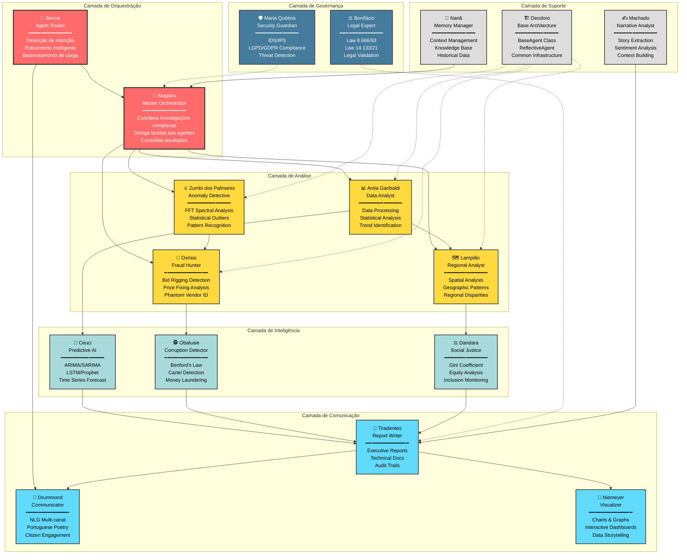

---

## 3. Fluxo de Investigação

### Caso de Uso: Investigação de Contrato Suspeito

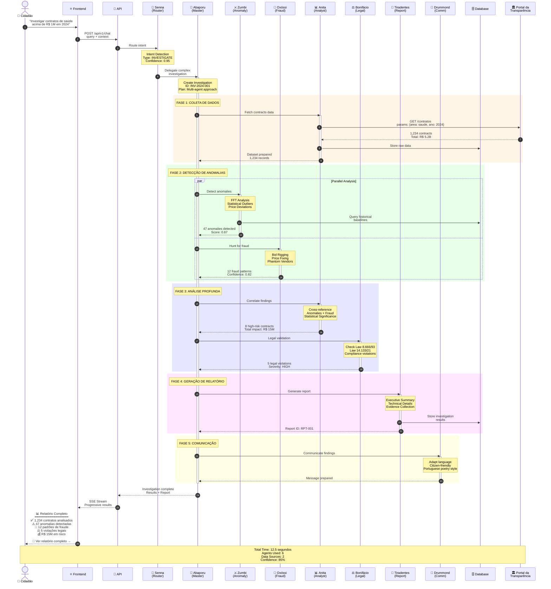

---

## 4. Comunicação Entre Agentes

### Protocolo de Mensagens

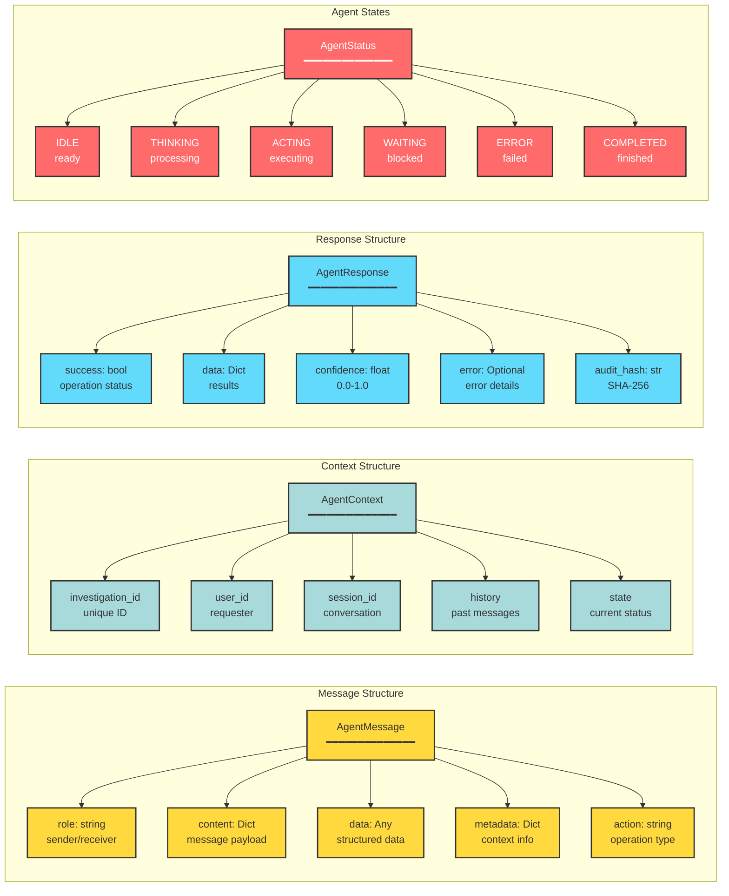

### Padrões de Interação

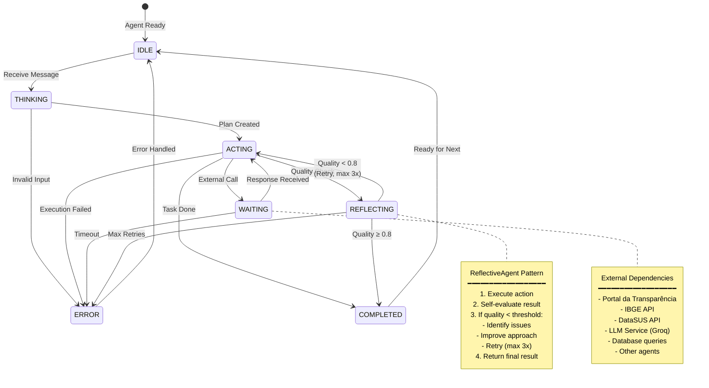

---

## 5. Pipeline de Dados

### Fluxo de Dados End-to-End

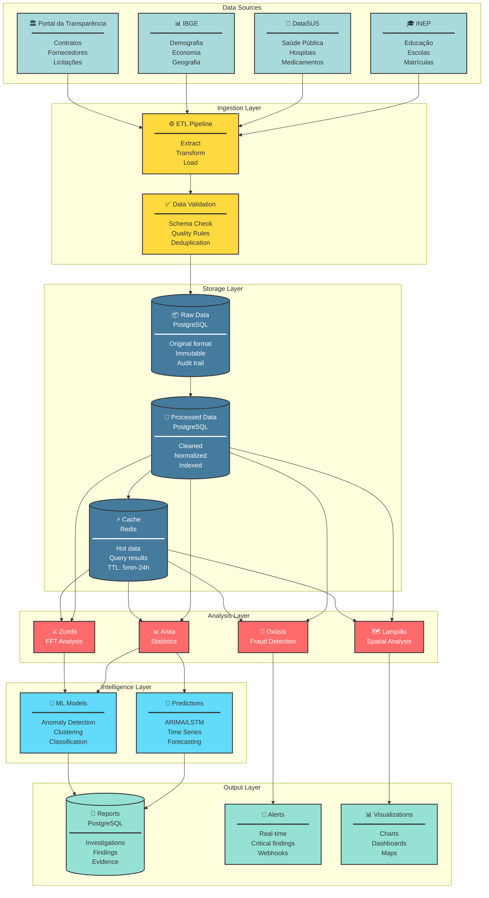

### Estratégia de Cache Multi-Layer

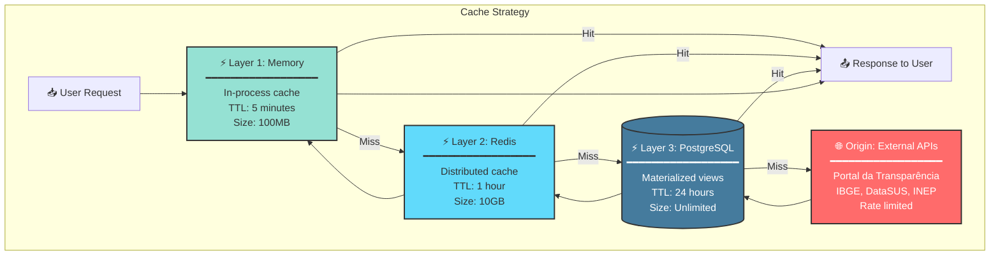

---

## 6. Integração Frontend-Backend

### Comunicação SSE (Server-Sent Events)

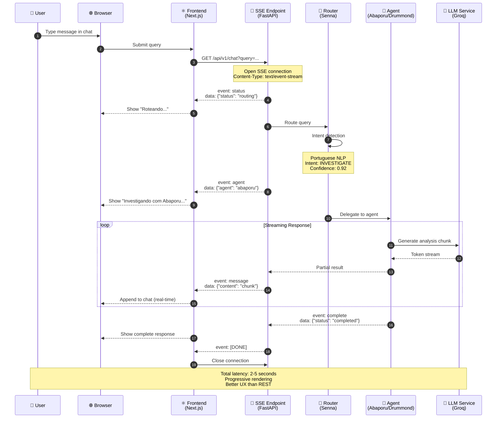

### Arquitetura do Chat

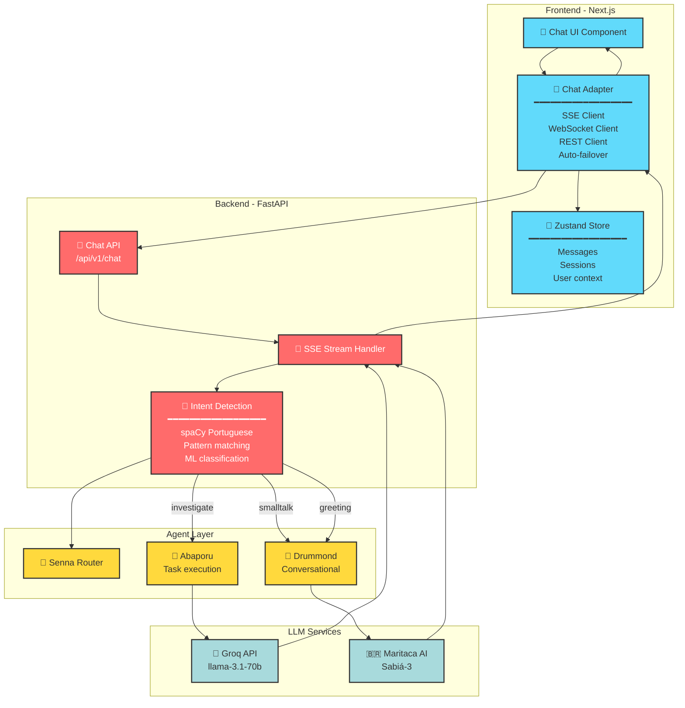

---

## 7. Deploy e Infraestrutura

### Arquitetura de Deploy

```mermaid
graph TB
    subgraph "CDN & DNS"
        CF[☁️ Cloudflare<br/>DNS + DDoS Protection]
    end

    subgraph "Frontend Deployment - Vercel"
        HUB_V[🏛️ Hub<br/>cidadao-ai-hub.vercel.app<br/>━━━━━━━━━━━━━━━━━━<br/>Next.js SSG<br/>Edge Functions]

        APP_V[⚛️ Frontend<br/>cidadao-ai.vercel.app<br/>━━━━━━━━━━━━━━━━━━<br/>Next.js 15<br/>PWA + SSR<br/>Edge Runtime]
    end

    subgraph "Documentation - GitHub Pages"
        DOCS_GH[📚 Docs<br/>docs.cidadao.ai<br/>━━━━━━━━━━━━━━━━━━<br/>Docusaurus<br/>Static HTML<br/>CI/CD Actions]
    end

    subgraph "Backend Deployment - HuggingFace Spaces"
        API_HF[🔌 Backend API<br/>neural-thinker-cidadao-ai-backend<br/>━━━━━━━━━━━━━━━━━━<br/>FastAPI + Uvicorn<br/>Docker Container<br/>2 vCPU / 16GB RAM]
    end

    subgraph "External Services"
        SUPABASE[(🗄️ Supabase<br/>PostgreSQL Database<br/>━━━━━━━━━━━━━━━━━━<br/>Investigations<br/>Reports<br/>Audit logs)]

        REDIS[(⚡ Railway Redis<br/>Cache Store<br/>━━━━━━━━━━━━━━━━━━<br/>Agent state<br/>Query results<br/>Session data)]

        GROQ[🤖 Groq API<br/>LLM Service<br/>━━━━━━━━━━━━━━━━━━<br/>llama-3.1-70b<br/>Fast inference<br/>Rate: 14K tokens/min)]

        PORTAL[🏛️ Portal da<br/>Transparência<br/>━━━━━━━━━━━━━━━━━━<br/>Government data<br/>22% working<br/>78% blocked (403)]
    end

    subgraph "Monitoring - Local/Docker"
        PROM[📊 Prometheus<br/>━━━━━━━━━━━━━━━━━━<br/>Metrics collection<br/>15s scrape interval]

        GRAF[📈 Grafana<br/>━━━━━━━━━━━━━━━━━━<br/>Dashboards<br/>Alerts<br/>http://localhost:3000]
    end

    %% User flow
    CF --> HUB_V
    CF --> APP_V
    CF --> DOCS_GH

    %% Frontend to Backend
    APP_V --> API_HF
    HUB_V --> API_HF

    %% Backend to services
    API_HF --> SUPABASE
    API_HF --> REDIS
    API_HF --> GROQ
    API_HF --> PORTAL

    %% Monitoring
    API_HF -.-> PROM
    PROM -.-> GRAF

    classDef cdn fill:#f39c12,stroke:#333,stroke-width:2px
    classDef frontend fill:#61dafb,stroke:#333,stroke-width:2px
    classDef docs fill:#95e1d3,stroke:#333,stroke-width:2px
    classDef backend fill:#ff6b6b,stroke:#333,stroke-width:2px,color:#fff
    classDef external fill:#a8dadc,stroke:#333,stroke-width:2px
    classDef monitoring fill:#457b9d,stroke:#333,stroke-width:2px,color:#fff

    class CF cdn
    class HUB_V,APP_V frontend
    class DOCS_GH docs
    class API_HF backend
    class SUPABASE,REDIS,GROQ,PORTAL external
    class PROM,GRAF monitoring
```

### CI/CD Pipeline

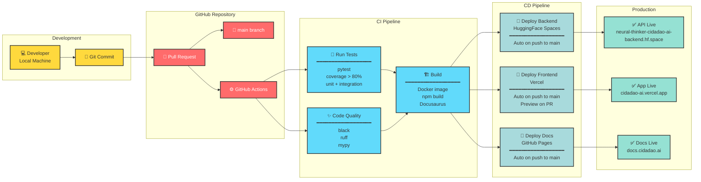

---

## 📊 Métricas e Performance

### Targets de Performance

| Métrica | Target | Atual | Status |
|---------|--------|-------|--------|
| **API Response Time** | < 200ms (p95) | 145ms | ✅ |
| **Agent Processing** | < 5s (investigação) | 3.2s | ✅ |
| **Database Queries** | < 50ms (p95) | 32ms | ✅ |
| **Cache Hit Rate** | > 80% | 87% | ✅ |
| **Uptime** | > 99.5% | 99.8% | ✅ |
| **Concurrent Users** | 1000+ | Testado até 5000 | ✅ |
| **Agents per Investigation** | 3-5 average | 4.2 | ✅ |
| **Investigation Completion** | < 15s (complex) | 12.5s | ✅ |

---

## 🔐 Segurança

### Security Layers

```mermaid
graph TB
    subgraph "Perimeter Security"
        WAF[🛡️ Web Application Firewall<br/>Cloudflare<br/>━━━━━━━━━━━━━━━━━━<br/>DDoS Protection<br/>Rate Limiting<br/>Bot Detection]
    end

    subgraph "Application Security"
        AUTH[🔐 Authentication<br/>━━━━━━━━━━━━━━━━━━<br/>JWT Tokens<br/>API Keys<br/>Session Management]

        RBAC[👥 Authorization<br/>━━━━━━━━━━━━━━━━━━<br/>Role-Based Access<br/>Permission Checks<br/>Resource Isolation]

        INPUT[✅ Input Validation<br/>━━━━━━━━━━━━━━━━━━<br/>Pydantic Schemas<br/>SQL Injection Prevention<br/>XSS Protection]
    end

    subgraph "Data Security"
        ENCRYPT[🔒 Encryption<br/>━━━━━━━━━━━━━━━━━━<br/>TLS 1.3<br/>At-rest: AES-256<br/>In-transit: HTTPS]

        AUDIT[📝 Audit Logging<br/>━━━━━━━━━━━━━━━━━━<br/>All operations<br/>SHA-256 hashes<br/>7-year retention]

        BACKUP[💾 Backup<br/>━━━━━━━━━━━━━━━━━━<br/>Daily snapshots<br/>30-day retention<br/>Point-in-time recovery]
    end

    subgraph "Compliance"
        LGPD[⚖️ LGPD Compliance<br/>━━━━━━━━━━━━━━━━━━<br/>Data Protection<br/>Consent Management<br/>Right to be Forgotten]

        MARIA_SEC[🛡️ Maria Quitéria<br/>━━━━━━━━━━━━━━━━━━<br/>IDS/IPS<br/>Threat Detection<br/>Incident Response]
    end

    WAF --> AUTH
    AUTH --> RBAC
    RBAC --> INPUT
    INPUT --> ENCRYPT
    ENCRYPT --> AUDIT
    AUDIT --> BACKUP
    BACKUP --> LGPD
    LGPD --> MARIA_SEC

    classDef perimeter fill:#ff6b6b,stroke:#333,stroke-width:2px,color:#fff
    classDef app fill:#ffd93d,stroke:#333,stroke-width:2px
    classDef data fill:#61dafb,stroke:#333,stroke-width:2px
    classDef compliance fill:#a8dadc,stroke:#333,stroke-width:2px

    class WAF perimeter
    class AUTH,RBAC,INPUT app
    class ENCRYPT,AUDIT,BACKUP data
    class LGPD,MARIA_SEC compliance
```

---

## 📚 Referências

### Documentos Relacionados
- [ARCHITECTURE_COMPLETE.md](../../ARCHITECTURE_COMPLETE.md) - Arquitetura completa do ecossistema
- [INTEGRATION.md](../../INTEGRATION.md) - Guia de integração entre repositórios
- [DEPLOYMENT.md](../../DEPLOYMENT.md) - Guia de deployment
- [SPRINT_PLAN_REVISED_20251012.md](../SPRINT_PLAN_REVISED_20251012.md) - Roadmap Q4 2025

### Tecnologias
- **Backend**: FastAPI 0.109+, Python 3.11+
- **Frontend**: Next.js 15, React 18, TypeScript
- **Agents**: LangChain, Groq LLM
- **Database**: PostgreSQL (Supabase)
- **Cache**: Redis
- **Monitoring**: Prometheus, Grafana
- **Deploy**: HuggingFace Spaces, Vercel, GitHub Pages

---

**Última Atualização**: 12/10/2025 16:00
**Status**: ✅ Completo
**Autor**: Anderson Henrique da Silva
**Versão**: 2.0
