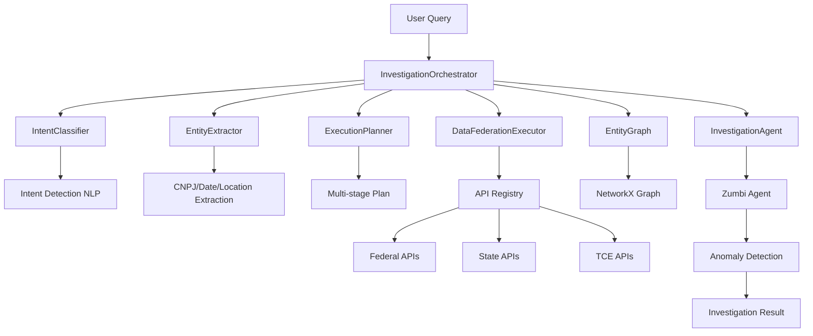

# 🎭 Sistema de Orquestração - Cidadão.AI Backend

**Autor**: Anderson Henrique da Silva
**Data de Criação**: 2025-10-16 10:45:00 -03:00
**Última Atualização**: 2025-10-16 10:45:00 -03:00

> **Sistema avançado de orquestração de investigações multi-API**
> Coordena coleta de dados, extração de entidades, planejamento de execução e análise de anomalias

---

## 📋 Índice

1. [Visão Geral](#visão-geral)
2. [Arquitetura](#arquitetura)
3. [Componentes](#componentes)
4. [Fluxo de Execução](#fluxo-de-execução)
5. [Modelos de Dados](#modelos-de-dados)
6. [API Registry](#api-registry)
7. [Query Planner](#query-planner)
8. [Data Federation](#data-federation)
9. [Entity Graph](#entity-graph)
10. [Resiliência](#resiliência)
11. [Exemplos de Uso](#exemplos-de-uso)

---

## 🎯 Visão Geral

O **Sistema de Orquestração** é o cérebro do Cidadão.AI Backend, responsável por:

### Responsabilidades

✅ **Classificação de Intenção** - Entende o que o usuário quer
✅ **Extração de Entidades** - Identifica CNPJ, datas, locais, valores
✅ **Planejamento de Execução** - Cria plano multi-stage otimizado
✅ **Federação de Dados** - Executa queries em múltiplas APIs
✅ **Construção de Grafos** - Mapeia relacionamentos entre entidades
✅ **Detecção de Anomalias** - Integração automática com agente Zumbi
✅ **Resiliência** - Circuit breakers e retry policies

### Localização no Código

```
src/services/orchestration/
├── __init__.py
├── orchestrator.py (255 linhas) ⭐ CORE
├── models/
│   ├── __init__.py
│   ├── entities.py - Modelos de entidades
│   ├── api_response.py - Respostas padronizadas
│   └── investigation.py - Contexto de investigação
├── api_registry/
│   ├── __init__.py
│   └── registry.py - Registro de APIs disponíveis
├── query_planner/
│   ├── __init__.py
│   ├── intent_classifier.py - Classificação NLP
│   ├── entity_extractor.py - Extração de entidades
│   └── execution_planner.py - Planejamento
├── data_federation/
│   ├── __init__.py
│   └── executor.py - Execução federada
├── entity_graph/
│   ├── __init__.py
│   └── graph.py - Grafo de relacionamentos
├── resilience/
│   ├── __init__.py
│   └── circuit_breaker.py - Resiliência
└── agents/
    ├── __init__.py
    └── agent_adapter.py - Adapter para agentes
```

---

## 🏗️ Arquitetura

### Diagrama de Componentes



### Fluxo de Dados

```
┌─────────────────────────────────────────────────────────────────┐
│                      USER QUERY                                  │
│   "Investigar contratos de saúde do Rio de Janeiro em 2024"     │
└─────────────────────────────────────────────────────────────────┘
                              │
                              ▼
┌─────────────────────────────────────────────────────────────────┐
│ STEP 1: INTENT CLASSIFICATION                                    │
│ → Intent: CONTRACT_ANOMALY_DETECTION                            │
│ → Confidence: 0.95                                               │
└─────────────────────────────────────────────────────────────────┘
                              │
                              ▼
┌─────────────────────────────────────────────────────────────────┐
│ STEP 2: ENTITY EXTRACTION                                        │
│ → Entities:                                                      │
│   • category: "saúde"                                           │
│   • location: "Rio de Janeiro"                                  │
│   • date_range: ["2024-01-01", "2024-12-31"]                   │
└─────────────────────────────────────────────────────────────────┘
                              │
                              ▼
┌─────────────────────────────────────────────────────────────────┐
│ STEP 3: EXECUTION PLANNING                                       │
│ → Plan (3 stages):                                               │
│   1. Fetch contracts from Portal da Transparência               │
│   2. Enrich with IBGE demographic data                          │
│   3. Analyze with DataSUS health indicators                     │
│ → Estimated duration: 12.5s                                      │
└─────────────────────────────────────────────────────────────────┘
                              │
                              ▼
┌─────────────────────────────────────────────────────────────────┐
│ STEP 4: DATA FEDERATION EXECUTION                                │
│ → Execute stages in parallel/sequential                          │
│ → Collect results from multiple APIs                             │
│ → Handle failures with circuit breaker                           │
└─────────────────────────────────────────────────────────────────┘
                              │
                              ▼
┌─────────────────────────────────────────────────────────────────┐
│ STEP 5: ENTITY GRAPH CONSTRUCTION                                │
│ → Extract entities from results                                  │
│ → Build relationship graph                                       │
│ → Statistics: 45 entities, 120 relationships                     │
└─────────────────────────────────────────────────────────────────┘
                              │
                              ▼
┌─────────────────────────────────────────────────────────────────┐
│ STEP 6: ANOMALY DETECTION (if applicable)                        │
│ → Run Zumbi agent analysis                                       │
│ → Detect price anomalies, vendor concentration, etc.             │
│ → Results: 12 anomalies found                                    │
└─────────────────────────────────────────────────────────────────┘
                              │
                              ▼
┌─────────────────────────────────────────────────────────────────┐
│ STEP 7: RESULT AGGREGATION                                       │
│ → Combine all data and analysis                                  │
│ → Generate comprehensive investigation result                    │
│ → Return to user                                                 │
└─────────────────────────────────────────────────────────────────┘
```

---

## 🔧 Componentes

### 1. InvestigationOrchestrator

**Arquivo**: `src/services/orchestration/orchestrator.py`

Coordenador principal que gerencia todo o fluxo de investigação.

#### Principais Métodos

```python
class InvestigationOrchestrator:
    async def investigate(
        self,
        query: str,
        user_id: str | None = None,
        session_id: str | None = None,
    ) -> InvestigationResult:
        """
        Run a complete investigation from a user query.

        Pipeline:
        1. Extract entities from query
        2. Classify intent
        3. Create investigation context
        4. Create execution plan
        5. Execute plan
        6. Run anomaly detection (if applicable)
        7. Return results
        """
```

#### Dependências

```python
def __init__(
    self,
    api_registry: APIRegistry | None = None,
    intent_classifier: IntentClassifier | None = None,
    entity_extractor: EntityExtractor | None = None,
    execution_planner: ExecutionPlanner | None = None,
    data_executor: DataFederationExecutor | None = None,
    entity_graph: EntityGraph | None = None,
    investigation_agent: InvestigationAgentAdapter | None = None,
):
    # Dependency injection with defaults
    self.registry = api_registry or APIRegistry()
    self.intent_classifier = intent_classifier or IntentClassifier()
    self.entity_extractor = entity_extractor or EntityExtractor()
    self.execution_planner = execution_planner or ExecutionPlanner(self.registry)
    self.data_executor = data_executor or DataFederationExecutor(self.registry)
    self.entity_graph = entity_graph or EntityGraph()
    self.investigation_agent = investigation_agent or InvestigationAgentAdapter()
```

---

### 2. IntentClassifier

**Arquivo**: `src/services/orchestration/query_planner/intent_classifier.py`

Classifica a intenção do usuário usando NLP.

#### Intenções Suportadas

```python
class InvestigationIntent(Enum):
    """Supported investigation intents."""

    CONTRACT_ANOMALY_DETECTION = "contract_anomaly_detection"
    SUPPLIER_INVESTIGATION = "supplier_investigation"
    BUDGET_ANALYSIS = "budget_analysis"
    CORRUPTION_INDICATORS = "corruption_indicators"
    POLICY_EVALUATION = "policy_evaluation"
    GEOGRAPHIC_ANALYSIS = "geographic_analysis"
    TEMPORAL_ANALYSIS = "temporal_analysis"
    NETWORK_ANALYSIS = "network_analysis"
    GENERAL_INVESTIGATION = "general_investigation"
```

#### Exemplo de Uso

```python
classifier = IntentClassifier()

result = await classifier.classify(
    "Investigar contratos suspeitos de superfaturamento em São Paulo"
)

# Result:
# {
#     "intent": InvestigationIntent.CONTRACT_ANOMALY_DETECTION,
#     "confidence": 0.92,
#     "alternatives": [
#         ("supplier_investigation", 0.15),
#         ("corruption_indicators", 0.12)
#     ]
# }
```

---

### 3. EntityExtractor

**Arquivo**: `src/services/orchestration/query_planner/entity_extractor.py`

Extrai entidades estruturadas do texto em português.

#### Entidades Extraídas

| Tipo | Exemplos | Pattern |
|------|----------|---------|
| **CNPJ** | 12.345.678/0001-90 | Regex + validation |
| **Datas** | 15/10/2024, outubro de 2024 | spaCy + dateparser |
| **Locais** | Rio de Janeiro, RJ, Sudeste | NER + gazetteer |
| **Valores** | R$ 1.500.000,00 | Regex + number parser |
| **Órgãos** | Ministério da Saúde, INSS | NER + domain list |
| **Categorias** | saúde, educação, infraestrutura | Keyword matching |

#### Exemplo de Uso

```python
extractor = EntityExtractor()

entities = extractor.extract(
    "Analisar contratos acima de R$ 1 milhão do CNPJ 12.345.678/0001-90 em 2024"
)

# Result:
# {
#     "cnpj": ["12.345.678/0001-90"],
#     "valores": [1000000.00],
#     "date_range": ["2024-01-01", "2024-12-31"],
#     "organizations": [],
#     "locations": [],
#     "categories": []
# }
```

---

### 4. ExecutionPlanner

**Arquivo**: `src/services/orchestration/query_planner/execution_planner.py`

Cria planos de execução otimizados baseados em intenção e entidades.

#### Estrutura do Plano

```python
@dataclass
class ExecutionStage:
    """Single execution stage."""
    stage_id: str
    stage_type: str  # "fetch", "enrich", "analyze"
    api_endpoint: str
    parameters: dict[str, Any]
    dependencies: list[str]  # IDs of stages this depends on
    estimated_duration: float  # seconds
    retry_policy: dict[str, Any]

@dataclass
class ExecutionPlan:
    """Complete execution plan."""
    plan_id: str
    intent: InvestigationIntent
    stages: list[ExecutionStage]
    estimated_duration_seconds: float
    parallel_execution: bool
    metadata: dict[str, Any]
```

#### Estratégias de Otimização

1. **Paralelização**: Stages sem dependências executam em paralelo
2. **Priorização**: Stages críticos executam primeiro
3. **Caching**: Resultados intermediários são cacheados
4. **Fallback**: APIs alternativas se primária falhar

#### Exemplo de Plano

```python
planner = ExecutionPlanner(api_registry)

plan = planner.create_plan(
    intent=InvestigationIntent.CONTRACT_ANOMALY_DETECTION,
    entities={"category": "saúde", "location": "Rio de Janeiro"},
    context=investigation_context
)

# Result:
# ExecutionPlan(
#     plan_id="plan_abc123",
#     intent=CONTRACT_ANOMALY_DETECTION,
#     stages=[
#         ExecutionStage(
#             stage_id="stage_1",
#             stage_type="fetch",
#             api_endpoint="/api/v1/federal/pncp/contracts",
#             parameters={"category": "saúde"},
#             dependencies=[],
#             estimated_duration=3.5
#         ),
#         ExecutionStage(
#             stage_id="stage_2",
#             stage_type="enrich",
#             api_endpoint="/api/v1/federal/ibge/population",
#             parameters={},
#             dependencies=["stage_1"],
#             estimated_duration=1.2
#         ),
#         ExecutionStage(
#             stage_id="stage_3",
#             stage_type="analyze",
#             api_endpoint="/api/v1/agents/zumbi/invoke",
#             parameters={"threshold": 0.7},
#             dependencies=["stage_1", "stage_2"],
#             estimated_duration=5.8
#         )
#     ],
#     estimated_duration_seconds=10.5,
#     parallel_execution=True
# )
```

---

### 5. DataFederationExecutor

**Arquivo**: `src/services/orchestration/data_federation/executor.py`

Executa planos de forma eficiente com suporte a paralelização e resiliência.

#### Funcionalidades

✅ **Execução Paralela** - Asyncio tasks para stages independentes
✅ **Gestão de Dependências** - Aguarda completion de dependências
✅ **Circuit Breaker** - Proteção contra APIs instáveis
✅ **Retry Logic** - Exponential backoff em falhas
✅ **Timeout Management** - Timeout por stage e global
✅ **Result Aggregation** - Combina resultados de múltiplas fontes

#### Exemplo de Execução

```python
executor = DataFederationExecutor(api_registry)

result = await executor.execute_plan(
    plan=execution_plan,
    entities=extracted_entities
)

# Result:
# {
#     "duration_seconds": 9.8,
#     "stages_completed": 3,
#     "stages_failed": 0,
#     "stage_results": {
#         "stage_1": {
#             "status": "completed",
#             "duration": 3.2,
#             "data": [...contracts...]
#         },
#         "stage_2": {
#             "status": "completed",
#             "duration": 1.1,
#             "data": {...demographics...}
#         },
#         "stage_3": {
#             "status": "completed",
#             "duration": 5.5,
#             "data": {...anomaly_analysis...}
#         }
#     },
#     "results": {
#         "contracts": [...],
#         "demographics": {...},
#         "anomalies": [...]
#     }
# }
```

---

### 6. EntityGraph

**Arquivo**: `src/services/orchestration/entity_graph/graph.py`

Constrói grafo de relacionamentos entre entidades usando NetworkX.

#### Tipos de Entidades

```python
class EntityType(Enum):
    CONTRACT = "contract"
    SUPPLIER = "supplier"
    ORGANIZATION = "organization"
    PERSON = "person"
    LOCATION = "location"
    AMOUNT = "amount"
```

#### Tipos de Relacionamentos

```python
class RelationshipType(Enum):
    CONTRACTED_BY = "contracted_by"
    SUPPLIED_TO = "supplied_to"
    LOCATED_IN = "located_in"
    MANAGED_BY = "managed_by"
    RELATED_TO = "related_to"
    SUSPICIOUS_LINK = "suspicious_link"
```

#### Exemplo de Uso

```python
entity_graph = EntityGraph()

# Extract from investigation results
entity_graph.extract_from_investigation_result(investigation_results)

# Get statistics
stats = entity_graph.get_statistics()
# {
#     "total_entities": 45,
#     "total_relationships": 120,
#     "entity_types": {
#         "contract": 20,
#         "supplier": 15,
#         "organization": 10
#     },
#     "relationship_types": {
#         "contracted_by": 40,
#         "supplied_to": 30,
#         "suspicious_link": 5
#     }
# }

# Find suspicious patterns
suspicious_clusters = entity_graph.find_suspicious_clusters(
    threshold=0.7
)
```

---

### 7. APIRegistry

**Arquivo**: `src/services/orchestration/api_registry/registry.py`

Registro central de todas as APIs disponíveis.

#### APIs Registradas

**Federal APIs (7)**:
- IBGE (Geografia e Estatísticas)
- DataSUS (Saúde)
- INEP (Educação)
- PNCP (Contratos Públicos)
- Compras.gov.br
- Minha Receita (Receita Federal)
- BCB (Banco Central)

**State APIs (6 TCEs + 5 CKAN)**:
- TCE-SP, TCE-RJ, TCE-MG, TCE-BA, TCE-PE, TCE-CE
- CKAN: São Paulo, Rio de Janeiro, Rio Grande do Sul, Santa Catarina, Bahia

**Portal da Transparência**:
- Contratos, Fornecedores, Órgãos, etc.

#### Estrutura do Registro

```python
@dataclass
class APIEndpoint:
    api_id: str
    name: str
    base_url: str
    endpoint_path: str
    method: str  # GET, POST
    parameters: dict[str, Any]
    auth_required: bool
    rate_limit: int  # requests per minute
    timeout: float  # seconds
    circuit_breaker_threshold: int
```

---

## 🚀 Fluxo de Execução Detalhado

### Exemplo Completo

```python
from src.services.orchestration import InvestigationOrchestrator

# Initialize orchestrator
orchestrator = InvestigationOrchestrator()

# Run investigation
result = await orchestrator.investigate(
    query="Investigar contratos de saúde acima de R$ 1 milhão em 2024",
    user_id="user_123",
    session_id="session_456"
)

# Access results
print(f"Investigation ID: {result.investigation_id}")
print(f"Intent: {result.intent}")
print(f"Duration: {result.total_duration_seconds:.2f}s")
print(f"Entities found: {len(result.entities_found)}")
print(f"Stages completed: {len(result.stage_results)}")

# Anomaly detection results (if applicable)
if "anomaly_detection" in result.metadata:
    anomaly_data = result.metadata["anomaly_detection"]
    print(f"Anomalies found: {len(anomaly_data['anomalies_found'])}")

    for anomaly in anomaly_data['anomalies_found']:
        print(f"  - {anomaly['type']}: {anomaly['description']}")
```

---

## 📊 Modelos de Dados

### InvestigationContext

```python
@dataclass
class InvestigationContext:
    """Context for an investigation."""
    user_query: str
    user_id: str | None
    session_id: str | None
    cnpj: list[str] | None = None
    date_range: tuple[str, str] | None = None
    locations: list[str] | None = None
    values: list[float] | None = None
    organizations: list[str] | None = None
    categories: list[str] | None = None
    metadata: dict[str, Any] = field(default_factory=dict)
```

### InvestigationResult

```python
@dataclass
class InvestigationResult:
    """Result of a complete investigation."""
    investigation_id: str
    intent: InvestigationIntent
    context: InvestigationContext
    plan: ExecutionPlan
    stage_results: list[dict[str, Any]]
    entities_found: list[dict[str, Any]]
    confidence_score: float
    total_duration_seconds: float
    status: str  # "pending", "running", "completed", "failed"
    error: str | None = None
    metadata: dict[str, Any] = field(default_factory=dict)

    def mark_running(self):
        self.status = "running"

    def mark_completed(self):
        self.status = "completed"

    def mark_failed(self, error: str):
        self.status = "failed"
        self.error = error
```

---

## 🛡️ Resiliência

### Circuit Breaker

**Arquivo**: `src/services/orchestration/resilience/circuit_breaker.py`

Protege contra APIs instáveis com pattern Circuit Breaker.

#### Estados

```
[CLOSED] → (failures exceed threshold) → [OPEN]
[OPEN] → (timeout expires) → [HALF_OPEN]
[HALF_OPEN] → (success) → [CLOSED]
[HALF_OPEN] → (failure) → [OPEN]
```

#### Configuração

```python
circuit_breaker = CircuitBreaker(
    failure_threshold=3,  # Open after 3 failures
    timeout=60.0,  # Try again after 60s
    half_open_max_calls=1  # Test with 1 call in half-open
)
```

### Retry Policy

Exponential backoff com jitter:

```python
retry_policy = {
    "max_attempts": 3,
    "base_delay": 1.0,  # seconds
    "max_delay": 10.0,
    "exponential_base": 2,
    "jitter": True
}

# Delays: 1s, 2s + jitter, 4s + jitter
```

---

## 🎯 Exemplos de Uso

### Exemplo 1: Investigação Simples

```python
orchestrator = InvestigationOrchestrator()

result = await orchestrator.investigate(
    query="Contratos da prefeitura do Rio em 2024"
)

print(f"Found {len(result.entities_found)} entities")
print(f"Completed in {result.total_duration_seconds:.2f}s")
```

### Exemplo 2: Com User Context

```python
result = await orchestrator.investigate(
    query="Analisar fornecedores suspeitos",
    user_id="analyst_123",
    session_id="session_abc"
)
```

### Exemplo 3: Acessando Entity Graph

```python
result = await orchestrator.investigate(query="...")

# Get entity graph
entity_graph = orchestrator.get_entity_graph()

# Find suspicious clusters
clusters = entity_graph.find_suspicious_clusters(threshold=0.7)

print(f"Found {len(clusters)} suspicious clusters")
```

---

## 📈 Performance

### Métricas Típicas

| Métrica | Valor Típico | Max Observado |
|---------|--------------|---------------|
| **Intent Classification** | 50ms | 150ms |
| **Entity Extraction** | 100ms | 300ms |
| **Plan Creation** | 80ms | 200ms |
| **Data Execution** | 5-10s | 30s |
| **Anomaly Detection** | 2-5s | 15s |
| **Total Investigation** | 8-15s | 45s |

### Otimizações Implementadas

✅ Parallel stage execution
✅ Response caching (5min TTL)
✅ Connection pooling
✅ Async/await throughout
✅ Circuit breakers on external APIs
✅ Retry with exponential backoff

---

## 🚧 Roadmap

### Próximas Melhorias

- [ ] ML-based intent classification (currently rule-based)
- [ ] Advanced entity linking across sources
- [ ] Real-time streaming execution
- [ ] Distributed tracing with OpenTelemetry
- [ ] Advanced graph algorithms (community detection, centrality)
- [ ] Intelligent plan optimization based on historical performance
- [ ] Multi-language support (currently Portuguese only)

---

## 📚 Referências

- **Orchestrator**: `src/services/orchestration/orchestrator.py`
- **Models**: `src/services/orchestration/models/`
- **API Registry**: `src/services/orchestration/api_registry/`
- **Query Planner**: `src/services/orchestration/query_planner/`
- **Data Federation**: `src/services/orchestration/data_federation/`
- **Entity Graph**: `src/services/orchestration/entity_graph/`
- **Tests**: `tests/unit/services/test_orchestration.py`

---

**Sistema de Orquestração - O cérebro que coordena todo o Cidadão.AI 🧠**
