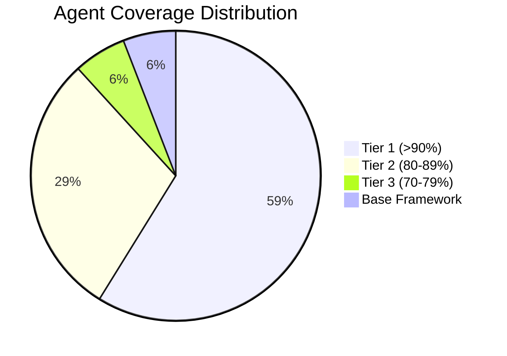

# Cidadao.AI Backend

**Multi-Agent AI System for Brazilian Government Transparency**

[](https://cidadao-api-production.up.railway.app/)
[-success)](https://github.com/anderson-ufrj/cidadao.ai-backend)
[](https://github.com/anderson-ufrj/cidadao.ai-backend)
[](agents/01-README.md)

---

## What is Cidadao.AI?

Cidadao.AI is a **production multi-agent AI system** designed to analyze Brazilian government transparency data. It features **17 specialized AI agents** with unique Brazilian cultural identities, each responsible for different aspects of data investigation, analysis, and reporting.

!!! success "Production Status"
    **Live at**: [cidadao-api-production.up.railway.app](https://cidadao-api-production.up.railway.app/)

    - 99.9% uptime since October 2025
    - 17 agents operational (16 functional + 1 base framework)
    - 323+ API endpoints
    - PostgreSQL + Redis infrastructure

---

## Quick Links

<div class="grid cards" markdown>

-   :robot:{ .lg .middle } **Agents**

    ---

    Explore our 17 AI agents with Brazilian cultural identities

    [:octicons-arrow-right-24: View Agents](agents/01-README.md)

-   :building_construction:{ .lg .middle } **Architecture**

    ---

    Understand the multi-agent system design

    [:octicons-arrow-right-24: Architecture](architecture/README.md)

-   :electric_plug:{ .lg .middle } **API Reference**

    ---

    323+ endpoints for transparency data

    [:octicons-arrow-right-24: API Docs](api/02-README-usage-guide.md)

-   :rocket:{ .lg .middle } **Deployment**

    ---

    Deploy to Railway, Docker, or cloud

    [:octicons-arrow-right-24: Deploy Guide](deployment/README.md)

</div>

---

## Featured Agents

| Agent | Role | Coverage |
|-------|------|----------|
| **Zumbi dos Palmares** | Anomaly Detection | 96.32% |
| **Anita Garibaldi** | Pattern Analysis | 94.87% |
| **Oxossi** | Data Hunting | 94.44% |
| **Abaporu** | Master Orchestration | 86% |
| **Obaluaie** | Corruption Detection | 81% |

[View all 17 agents :material-arrow-right:](agents/01-README.md){ .md-button }

---

## Getting Started

### Installation

```bash
# Clone repository
git clone https://github.com/anderson-ufrj/cidadao.ai-backend.git
cd cidadao.ai-backend

# Install dependencies
make install-dev

# Configure environment
cp .env.example .env
# Edit .env with your API keys (MARITACA_API_KEY or ANTHROPIC_API_KEY)
```

### Run Development Server

```bash
make run-dev
# API available at http://localhost:8000/docs
```

### Run Tests

```bash
JWT_SECRET_KEY=test SECRET_KEY=test make test
```

---

## Key Features

### Multi-Agent System

- **17 specialized agents** with unique Brazilian cultural identities
- **Reflective architecture** with quality thresholds and automatic improvement
- **Lazy loading** for 367x faster startup (3.81ms vs 1460ms)

### Government Data Integration

- **30+ transparency APIs** integrated (federal, state, municipal)
- **Portal da Transparencia** integration
- **Real-time contract investigation**

### Production-Ready

- **PostgreSQL + Redis** infrastructure
- **Prometheus + Grafana** monitoring
- **Railway deployment** with 99.9% uptime

---

## Project Status



!!! info "Current Sprint"
    **December 2025**: Focus on test coverage improvement, additional government APIs, and frontend integration enhancements.

---

## Documentation Structure

| Section | Description |
|---------|-------------|
| [Agents](agents/01-README.md) | All 17 agents with implementation details |
| [Architecture](architecture/README.md) | System design, patterns, and diagrams |
| [API](api/02-README-usage-guide.md) | REST endpoints, streaming, WebSocket |
| [Development](development/README.md) | Setup, contributing, best practices |
| [Deployment](deployment/README.md) | Railway, Docker, production guides |
| [Project](project/INDEX.md) | Roadmap, status, planning |

---

## Contributing

We welcome contributions! See our [Contributing Guide](development/CONTRIBUTING.md) for details.

```bash
# Run checks before committing
make check
```

---

## Links

- **Production API**: [cidadao-api-production.up.railway.app](https://cidadao-api-production.up.railway.app/)
- **API Docs (Swagger)**: [/docs](https://cidadao-api-production.up.railway.app/docs)
- **GitHub**: [anderson-ufrj/cidadao.ai-backend](https://github.com/anderson-ufrj/cidadao.ai-backend)
