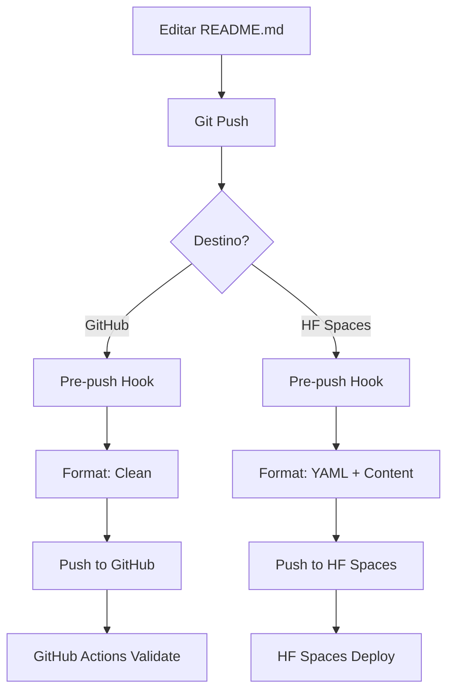

# README Sync System - Cidadão.AI

## 🎯 Objetivo

O sistema de sincronização automática resolve o problema de incompatibilidade entre os formatos de README requeridos pelo GitHub e Hugging Face Spaces.

## 🚨 Problema Identificado

- **GitHub**: Precisa de README limpo, sem metadata YAML
- **HF Spaces**: Requer header YAML com configurações específicas
- **Conflito**: O mesmo arquivo README.md não pode atender ambos

## ✅ Solução Implementada

### 1. **Script de Sincronização Inteligente**

```bash
# Verificar status atual
python scripts/sync_readme.py --check

# Sincronizar automaticamente baseado no remote
python scripts/sync_readme.py --auto-detect

# Sincronizar manualmente
python scripts/sync_readme.py --target github
python scripts/sync_readme.py --target hf
```

**Recursos:**
- ✅ Detecção automática de ambiente (GitHub/HF)
- ✅ Backup automático antes de modificações
- ✅ Validação de formato YAML
- ✅ Suporte a múltiplas fontes (README.md, README_HF.md)

### 2. **Git Hooks Automáticos**

```bash
# Configurar hooks
./scripts/setup_git_hooks.sh
```

**Funcionalidades:**
- ✅ Pre-push hook detecta o destino (GitHub/HF)
- ✅ Sincroniza README automaticamente antes do push
- ✅ Commit automático das mudanças
- ✅ Backup de segurança

### 3. **GitHub Actions**

**Workflow automático** (`.github/workflows/readme-sync.yml`):
- ✅ Validação de formato em Pull Requests
- ✅ Verificação de compatibilidade
- ✅ Sincronização manual via workflow_dispatch
- ✅ Relatórios de status

## 🛠️ Como Usar

### Configuração Inicial

```bash
# 1. Configurar git hooks
./scripts/setup_git_hooks.sh

# 2. Verificar status
python scripts/sync_readme.py --check
```

### Uso Diário

```bash
# Verificar antes de trabalhar
python scripts/sync_readme.py --check

# Push normal - automático
git push origin main    # Detecta GitHub
git push hf main       # Detecta HF Spaces

# Sincronização manual se necessário
python scripts/sync_readme.py --auto-detect
```

### Workflow de Desenvolvimento

1. **Editar documentação**: Sempre edite o README.md no formato GitHub (limpo)
2. **Push para GitHub**: Hook automaticamente mantém formato limpo
3. **Push para HF**: Hook automaticamente adiciona YAML header
4. **Verificação**: GitHub Actions valida ambos os formatos

## 🔧 Configuração HF Spaces

O YAML header incluí:

```yaml
---
title: Cidadão.AI - Public Transparency Platform
emoji: 🔍
colorFrom: green
colorTo: yellow
sdk: gradio
sdk_version: "5.0.0"
app_file: apps/gradio_app.py
pinned: true
license: apache-2.0
language: [pt, en]
tags: [transparency, government, corruption-detection]
---
```

## 🚨 Resolução de Problemas

### README fora de sync

```bash
# Força sincronização
python scripts/sync_readme.py --target github --backup
git add README.md
git commit -m "fix: sync README format"
```

### Hook não funciona

```bash
# Reconfigurar hooks
./scripts/setup_git_hooks.sh

# Verificar permissões
chmod +x .githooks/pre-push
```

### Conflito de merge

```bash
# Backup atual
python scripts/sync_readme.py --backup

# Reset para versão correta
git checkout origin/main -- README.md
python scripts/sync_readme.py --auto-detect
```

## 📊 Monitoramento

### Verificar Status

```bash
# Status completo
python scripts/sync_readme.py --check

# Saída esperada:
# 🔍 Checking README status...
# 📍 Current branch: main
# 🌐 Git remote: github
# 📝 README is configured for GitHub (clean format)
```

### GitHub Actions

- ✅ Validação automática em PRs
- ✅ Relatórios de compatibilidade
- ✅ Sincronização manual disponível

## 🎯 Benefícios

1. **Zero Erros**: Nunca mais erro de "Missing configuration in README"
2. **Automático**: Hooks cuidam da sincronização transparentemente
3. **Seguro**: Backups automáticos antes de modificações
4. **Flexível**: Suporte manual e automático
5. **Monitorado**: GitHub Actions validam formatos

## 🔄 Fluxo de Trabalho



## 📝 Comandos Rápidos

```bash
# Setup inicial
./scripts/setup_git_hooks.sh

# Verificação diária
python scripts/sync_readme.py --check

# Sincronização manual
python scripts/sync_readme.py --auto-detect

# Backup de emergência
python scripts/sync_readme.py --backup

# GitHub Actions manual
# Via interface: Actions → README Sync Manager → Run workflow
```

Este sistema garante que o README sempre esteja no formato correto para cada plataforma, eliminando erros de configuração no HF Spaces.